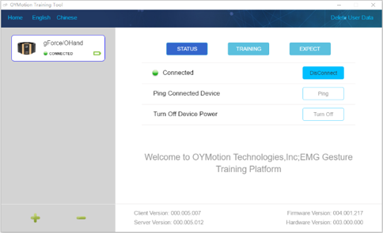
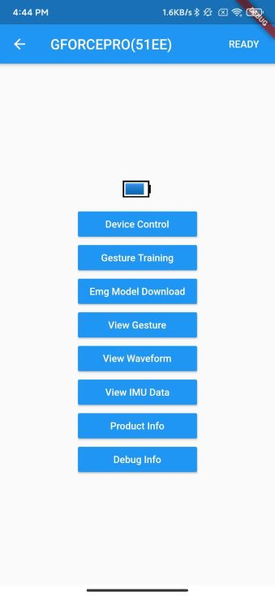

# Applications

***

## OTrain for gForceBLE

* OTrain is used to Connect to gForcePro/gForceBLE, Capture EMG raw data, Generate model and Update to gForcePro/gForceBLE
* Gestures are Customizable
* After gForcePro/gForceBLE is updated with trained model, it works off-line

### Hardware required:

* gForcePro/gForceBLE

* USB Dongle

 

### Screenshots

### Download

Download [click here](https://github.com/oymotion/OTrain/releases)

***

## gForce App for gForcePro

gForce App integrates gForce control, data display, gesture training, training model cloud upload and download functions, all in one App.

 

### Screenshots

### Download

[click here](http://gforce-portal.oymotion.com/)

***

## oym8CHWave

Open source EMG data manipulation tool for gForceBLE/gForcePro.
Displays waveforms according to EMG data from gForcePro. Sends sound on/off bit flags to oym8CHWaveArduino if oym8CHWaveArduino is connected.

 

### Screenshots

View source [click here](https://github.com/oymotion/oym8CHWave)

### Download

Download [click here](https://github.com/oymotion/oym8CHWave/releases)