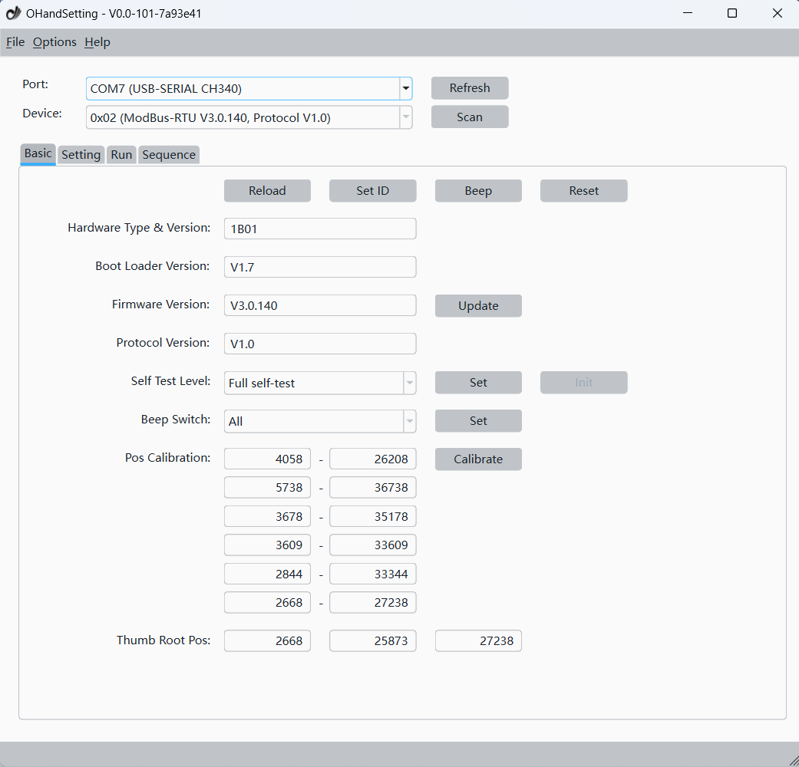

# OHandSetting

Application for Prosthetic/Robotic OHand.
Controls the fingers and updates firmware of Prosthetic/Robotic OHand.

***

## Screenshots

***

## Download

[ROH-A001/A002](https://github.com/oymotion/roh_firmware/tree/main/OHandSetting)

[ROH-AP001/LiteS001](https://github.com/oymotion/roh_gen2_firmware/tree/main/OHandSetting)
