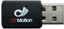
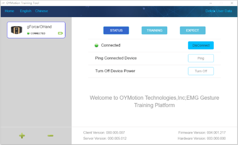
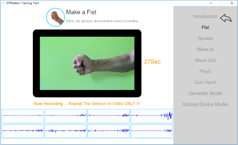
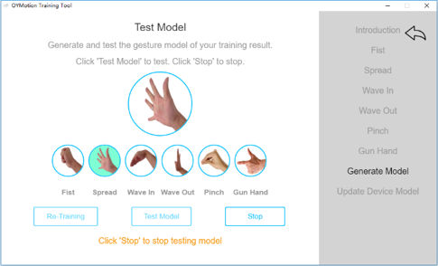

# OTrain for gForcePro

* OTrain is used to Connect to gForcePro, Capture EMG raw data, Generate model and Update to gForcePro
* Gestures are Customizable
* After gForcePro is updated with trained model, it works off-line

***

## Hardware required

* **gForcePro**

* **USB Dongle**

***

## Screenshots

***

## Download

Download [click here](https://github.com/oymotion/OTrain/releases)
