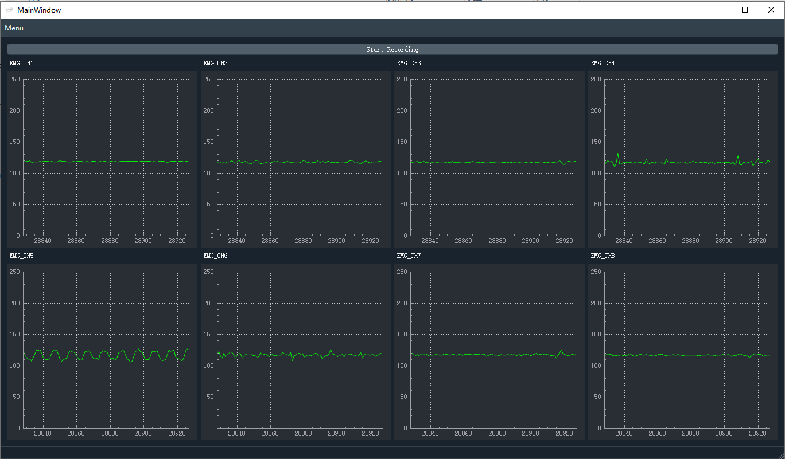

# oym8CHWave

***

Open source EMG data manipulation tool for gForceBLE/gForcePro.
Displays waveforms according to EMG data from gForcePro. Sends sound on/off bit flags to oym8CHWaveArduino if oym8CHWaveArduino is connected.

 

## Screenshots

## Source code

View source [click here](https://github.com/oymotion/oym8CHWave)

## Download

Download [click here](https://github.com/oymotion/oym8CHWave/releases)