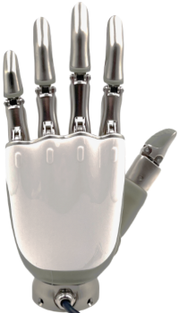
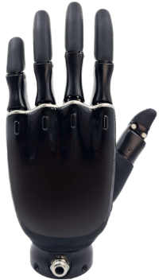
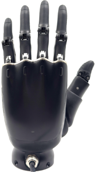

# ROHand Dexterous Hand User Guide

June 30th, 2025

***

## Overview

The ROHAND dexterous hand has a total of 11 motion joints, with 6 built-in motor drivers and the motor control circuit. With 6 active degrees of freedom, and a built-in PID motor control algorithm, the hand can mimic the human hand to achieve a variety of grasping grips. Typical applications include robot end effectors, educational and scientific research equipment, bionic prosthetics, etc.

ROHand dexterous hand with UART, RS485([Download driver](../assets/downloads/CH341SER.EXE)) or CAN physical interface, support SerialCtrl dedicated serial protocol, ModBus-RTU protocol and CAN protocol, can provide ROS / ROS2 platforms for secondary development with SDK (a license agreement needs to be signed).

ROHand is currently divided into the following versions:

|          ***ROH-A001/ROH-A002***          |          ***ROH-AP001***           |            ***ROH-LiteS001***            |
| :---------------------------------------: | :--------------------------------: | :--------------------------------------: |
|  |  |  |

***

## Links

[ROHand-A001/A002](https://github.com/oymotion/roh_firmware) to download the firmware, protocol and desktop application for *ROH-A001* and *ROH-A002* dexterous Hand.

[ROHand-AP001/LiteS001](https://github.com/oymotion/roh_gen2_firmware) to download the firmware, protocol and desktop application for *ROH-AP001* and *ROH-LiteS001* dexterous Hand.

[ROS package](https://github.com/oymotion/rohand_ros_pkg) to download the ros package for all dexterous hands.

[ROS2 package](https://github.com/oymotion/rohand_ros2_pkg) to download the ros2 package for all dexterous hands.

[URDF-A001/A002](https://github.com/oymotion/rohand_urdf_ros2) to download the urdf file for ROH-A001 and ROH-A002 dexterous hand.

[URDF-AP001](https://github.com/oymotion/rohand_gen2_urdf_ros2) to download the urdf file for ROH-AP001 dexterous hand.

[URDF-LiteS001](https://github.com/oymotion/rohand_lites_urdf_ros2) to download the urdf file for ROH-LiteS001 dexterous hand.

[ROHand Demos-A001/A002/LiteS001](https://github.com/oymotion/roh_demos) to download the demo code for ROH-A001, ROH-A002 and ROH-LiteS001 dexterous hand.

[ROHand Demos-AP001](https://github.com/oymotion/roh_gen2_demos) to download the demo code for ROH-AP001 dexterous hand.

[ROHand Demos with RM65](https://github.com/oymotion/roh_with_rm65) to download the demo code for all dexterous hand with Realman robotic arm RM65.

## Q&A

[ROH-A001/A002 Q&A](./FAQs_EN_V1.pdf)

[ROH-AP001/LiteS001 Q&A](./FAQs_EN_V2.pdf)
