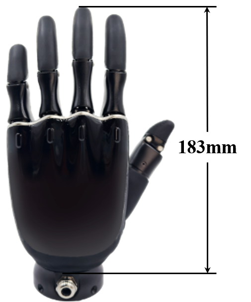
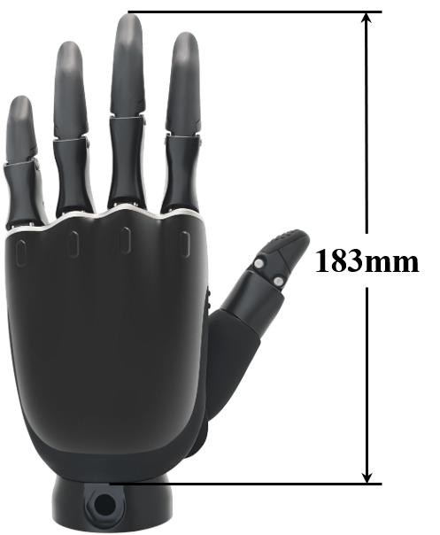
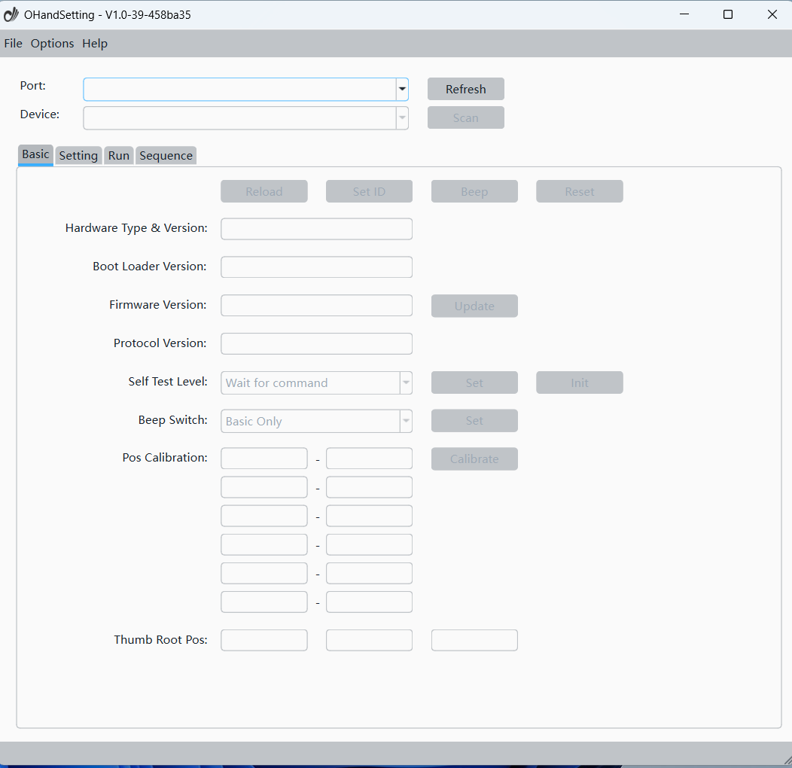

# ROHand Dexterous Hand

## Overview

The ROHAND Dexterous Hand comprises 11 motion joints with 6 built-in motor drivers and motor control circuits. Featuring 6 active degrees of freedom and an integrated PID motor control algorithm, this hand can mimic human hand movements to perform various grasping gestures. Typical applications include robotic end-effectors, educational and research equipment, as well as bionic prosthetics.

ROHand Dexterous Hand provides UART, RS485([Download Driver](https://www.wch.cn/downloads/CH341SER_EXE.html){: target="_blank"}) or CAN([Download Driver](https://peak-system.com.cn/driver/){: target="_blank"}) physical interfaces, supports SerialCtrl dedicated serial protocol, ModBus-RTU protocol and CAN protocol, and can provide SDK for secondary development on ROS/ROS2 platforms. It is currently divided into the following versions:  

|          ***ROH-A001/ROH-A002***          |          ***ROH-AP001***           |          ***ROH-AP002***           |              ***ROH-LiteS001***              |
| :---------------------------------------: | :--------------------------------: | :--------------------------------: | :------------------------------------------: |
|  |  |  |  |

## Ready to Use Out of the Box

|                                            RS485                                             |                                           CAN                                            |
| :------------------------------------------------------------------------------------------: | :--------------------------------------------------------------------------------------: |
| {: target="_blank"} | {: target="_blank"} |

## Host Computer Software

[<u>Windows</u>](../../assets/downloads/ROHand/OHandSetting-Windows.zip)

[<u>Ubuntu22</u>](../../assets/downloads/ROHand/OHandSetting-Ubuntu22.zip)

[<u>Ubuntu24</u>](../../assets/downloads/ROHand/OHandSetting-Ubuntu24.zip)

## Host Computer Software User Manual

[<u>View</u>](../../assets/downloads/ROHand/OHandSetting-Instruction-Manual.pdf){: target="_blank"}

## Host Computer Video Tutorial

{: target="_blank"}
