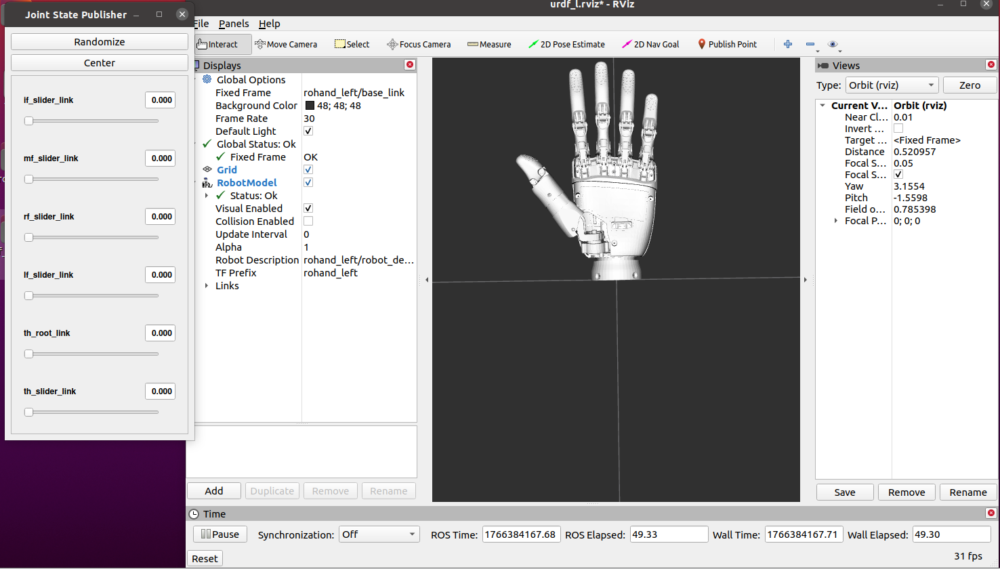
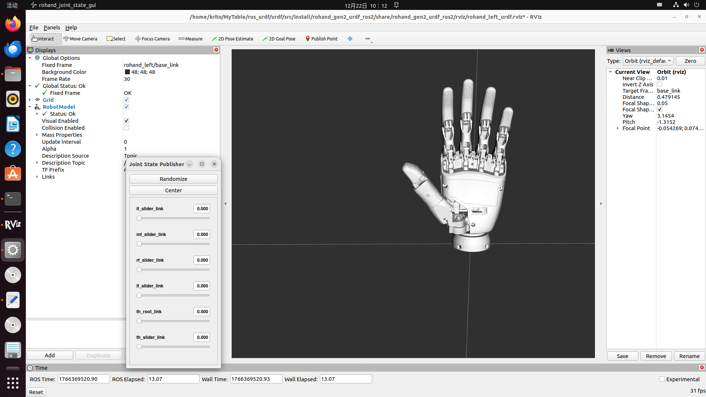
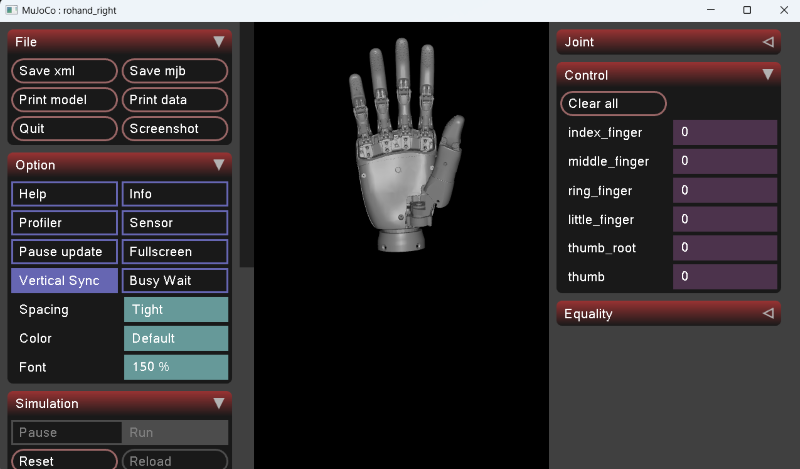

# ROH-AP001

## User Manual

[<u>ROH-AP001 User Manual</u>](../imgs/ROH-AP001-Dexterous-Hand-V1.0.7.pdf){: target="_blank"}

## Communication Protocol

[Serial&CAN](../ROH-Protocols/OHandSerialProtocol_Gen2.md)

[Modbus](../ROH-Protocols/OHandModBusRTUProtocol_Gen2.md)

## ROS1 Development Package

ROHand's ROS1 support is based on the [rohand_ros_pkg](https://github.com/oymotion/rohand_ros_pkg){: target="_blank"} package, the following is the usage environment:  

- The currently supported ROHHand series include ROH-A001, ROH-A002, ROH-LiteS001, ROH-AP001, and ROH-AP002.

- ROS1 supported Ubuntu versions: 20.04(Noetic)  

- ROHand supported nodes: ModBus-RTU, SerialCtrl and teleop (for debugging only)  

For installation details of ROS1 environment, please visit [fishros](https://fishros.org.cn/forum/topic/20/%E5%B0%8F%E9%B1%BC%E7%9A%84%E4%B8%80%E9%94%AE%E5%AE%89%E8%A3%85%E7%B3%BB%E5%88%97){: target="_blank"}

### 1. Install ROS1 environment

Use the one-click installation command to install ROS1 and select a supported version  

```Bash
wget http://fishros.com/install -O fishros && . fishros
```

### 2. Download rohand_ros_pkg

- Method 1: [Click this link](../../../assets/downloads/rohand_ros_pkg-main.zip) to download

- Method 2: Visit [rohand_ros_pkg](https://github.com/oymotion/rohand_ros_pkg){: target="_blank"} GitHub page to download the latest version  

- Method 3: Obtain via clone:  

    ```BASH
    cd ~
    mkdir -p ros_ws/src
    cd ros_ws/src
    git clone ssh://git@github.com/oymotion/rohand_ros_pkg
    ```

### 3. Run ROS1 project

Please visit [ROS1 README](../ROS/ROS1.md) for more details.

## ROS2 Development Package

ROHand's ROS2 support is based on the [rohand_ros2_pkg](https://github.com/oymotion/rohand_ros2_pkg){: target="_blank"} package, the following is the usage environment:  

- The currently supported ROHHand series include ROH-A001, ROH-A002, ROH-LiteS001, ROH-AP001, and ROH-AP002.

- ROS2 supported Ubuntu versions: 22.04(humble or rolling)  

- ROHand supported nodes: ModBus-RTU, SerialCtrl and teleop (for debugging only)  

For installation details of ROS1 environment, please visit [fishros](https://fishros.org.cn/forum/topic/20/%E5%B0%8F%E9%B1%BC%E7%9A%84%E4%B8%80%E9%94%AE%E5%AE%89%E8%A3%85%E7%B3%BB%E5%88%97){: target="_blank"}

### 1. Install ROS2 environment

Use the one-click installation command to install ROS2 and select a supported version  

```Bash
wget http://fishros.com/install -O fishros && . fishros
```

### 2. Download rohand_ROS2_pkg

- Method 1: [Click this link](../../../assets/downloads/ROHand/rohand_ros2_pkg-main.zip) to download

- Method 2: Visit [rohand_ros2_pkg](https://github.com/oymotion/rohand_ros2_pkg){: target="_blank"} GitHub page to download the latest version  

- Method 3: Obtain via clone:  

    ```BASH
    cd ~
    mkdir -p ros2_ws/src
    cd ros2_ws/src
    git clone ssh://git@github.com/oymotion/rohand_ros2_pkg
    ```

### 3. Run ROS2 project

Please visit [ROS2 README](../ROS/ROS2.md) for more details.

## URDF ROS1

ROHand's URDF ROS1 support is based on the [rohand_gen2_urdf_ros1](https://github.com/oymotion/rohand_gen2_urdf_ros1){: target="_blank"} package, the following is the usage environment:  

- The currently supported ROHHand series include ROH-AP001.

- ROS1 supported Ubuntu versions: 20.04(Noetic)  

- ROHand supported nodes: ModBus-RTU, SerialCtrl and teleop (for debugging only)  

For installation details of ROS1 environment, please visit [fishros](https://fishros.org.cn/forum/topic/20/%E5%B0%8F%E9%B1%BC%E7%9A%84%E4%B8%80%E9%94%AE%E5%AE%89%E8%A3%85%E7%B3%BB%E5%88%97){: target="_blank"}

### 1. Install ROS1 environment

Use the one-click installation command to install ROS1 and select a supported version  

```Bash
wget http://fishros.com/install -O fishros && . fishros
```

### 2. Download rohand_gen2_urdf_ros1

- Method 1: [Click this link](../../../assets/downloads/ROHand/rohand_gen2_urdf_ros1-main.zip) to download

- Method 2: Visit [rohand_gen2_urdf_ros1](https://github.com/oymotion/rohand_gen2_urdf_ros1){: target="_blank"} GitHub page to download the latest version  

- Method 3: Obtain via clone:  

    ```BASH
    cd ~
    mkdir -p ros_ws/src
    cd ros_ws/src
    git clone ssh://git@github.com/oymotion/rohand_gen2_urdf_ros1
    ```

### 3. Run URDF ROS1 project

Please visit [URDF README](../ROS/GEN2_URDF_ROS1.md) for more details.  

When running successfully, it should be as shown in the figure  



## URDF ROS2

ROHand's URDF ROS2 support is based on the [rohand_gen2_urdf_ros2](https://github.com/oymotion/rohand_gen2_urdf_ros2){: target="_blank"} package, the following is the usage environment:  

- The currently supported ROHHand series include ROH-AP001.

- ROS2 supported Ubuntu versions: 22.04(humble or rolling)  

- ROHand supported nodes: ModBus-RTU, SerialCtrl and teleop (for debugging only)  

For installation details of ROS1 environment, please visit [fishros](https://fishros.org.cn/forum/topic/20/%E5%B0%8F%E9%B1%BC%E7%9A%84%E4%B8%80%E9%94%AE%E5%AE%89%E8%A3%85%E7%B3%BB%E5%88%97){: target="_blank"}

### 1. Install ROS2 environment

Use the one-click installation command to install ROS2 and select a supported version  

```Bash
wget http://fishros.com/install -O fishros && . fishros
```

### 2. Download rohand_gen2_urdf_ros2

- Method 1: [Click this link](../../../assets/downloads/ROHand/rohand_gen2_urdf_ros2-main.zip) to download

- Method 2: Visit [rohand_gen2_urdf_ros2](https://github.com/oymotion/rohand_gen2_urdf_ros2){: target="_blank"} GitHub page to download the latest version  

- Method 3: Obtain via clone:  

    ```BASH
    cd ~
    mkdir -p ros2_ws/src
    cd ros2_ws/src
    git clone ssh://git@github.com/oymotion/rohand_gen2_urdf_ros2
    ```

### 3. Run URDF ROS2 project

Please visit [URDF README](../ROS/GEN2_URDF_ROS2.md) for more details.  

When running successfully, it should be as shown in the figure  



## Python Demos

These example programs aim to provide a convenient Python interface and sample code for the secondary development of the OYMotion dexterous hand. Through these example programs, users can easily achieve control of the dexterous hand, thereby accelerating the development process of dexterous hand-related applications.

### Supported Operating Systems and Software Version

#### Operating Systems

- Windows: Supports 64-bit versions under Windows 10/11 operating systems
- Linux: Supports the x64 architecture and ARM architecture of the Linux operating system

#### Software Version

- Python: Version 3.12 and above

### Download

- Method 1: [Click this link](../../../assets/downloads/ROHand/roh_gen2_demos-main.zip) to download  

- Method 2: Visit [roh_gen2_demos](https://github.com/oymotion/roh_gen2_demos){: target="_blank"} GitHub page to download the latest version  

- Method 3: Obtain via clone:  

    ```Bash
    git clone https://github.com/oymotion/roh_gen2_demos
    ```

### Run

After installation, you can find the README.md file under each sample project, which details how to install the required runtime environment and how to run the sample programs

### Introduction to the Demos

#### 1. gesture_ctrled_rohand

This example uses a computer camera to perform gesture recognition on the OYMotion dexterous hand, enabling it to control the dexterous hand based on the recognized gestures and also it shows the heatmap image

#### 2. gForce_ctrled_rohand

This example uses the myoelectric bracelet gForce series to control the dexterous hand to make different movements based on the trained gesture models

gForce APP for bracelet training, please refer to
[<u>this file</u>]((../../../assets/downloads/gForce/gForceAPP-User-Guide-202108.pdf)){: target="_blank"}. Goal: Train and apply the model

#### 3.glove_ctrled_rohand

This example controls the movement of the dexterous hand via a wireless Bluetooth glove or a wired glove and also it shows the heatmap image

#### 4.loop_test

This example implements a cyclic motion test for the dexterous hand to observe whether its movements are normal

#### 5.force_on_rohand

This example shows dexterous hand force data on the heatmap image

## SDK C/C++

### Download

- Method 1: [Click this link](../../../assets/downloads/ROHand/ohand_serial_sdk-master.zip){: target="_blank"} to download  

- Method 2: Visit [ohand_serial_sdk](https://github.com/oymotion/ohand_serial_sdk) GitHub page to download the latest version  

- Method 3: Obtain via clone:  

    ```Bash
    git clone https://github.com/oymotion/ohand_serial_sdk
    ```

### SDK Guide

[Click this link](../SDK/ROH_SDK_CXX.md) to get more information  

## SDK Python

### Download

- Method 1: [Click this link](../../../assets/downloads/ROHand/ohand_serial_sdk_python-main.zip) to download  

- Method 2: Visit [ohand_serial_sdk_python](https://github.com/oymotion/ohand_serial_sdk_python){: target="_blank"} to get Python SDK.  

- Method 3: Obtain via clone:  

    ```Bash
    git clone https://github.com/oymotion/ohand_serial_sdk_python
    ```

### SDK Guide

[Click this link](../SDK/ROH_SDK_Python.md) to get more details

## Mujoco

### Environment

- System: Windows 10/11 or ubuntu20.04 and above  
- module: mujoco

### Download Mujoco Project

- Method 1: [Click this link](../../../assets/downloads/ROHand/AP001_mujoco.zip) to download  

- Method 2: Visit [rohand_mujoco](https://github.com/oymotion/rohand_mujoco){: target="_blank"} to get Mujoco project.  

- Method 3: Obtain via clone:  

    ```Bash
    git clone https://github.com/oymotion/rohand_mujoco
    ```

### Run

```bash
python main.py
```

[Click this link](../MUJOCO/AP001.md) to get more details

When running successfully, it should be as shown in the figure:  

  

## Reference File For Force Data

[Click here to view](../imgs/AYSensor.pdf){: target="_blank"}  