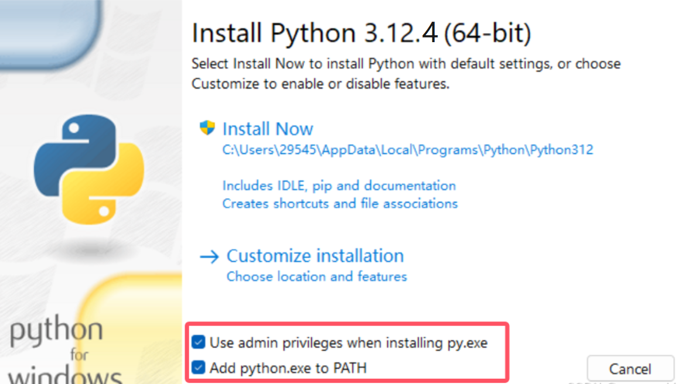
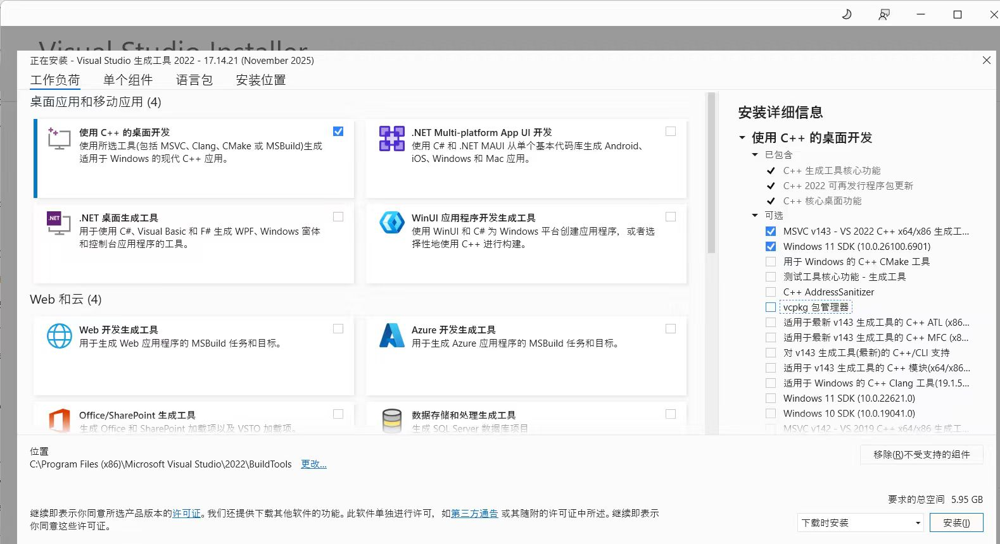
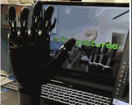

# ROH-Gen2-Demos Suitable for ROH-AP001/AP002

## Demo Acquisition

- Method 1: [Click this link](../../../assets/downloads/ROHand/roh_gen2_demos-main.zip) to download

- Method 2: Visit [ohand_serial_sdk](https://github.com/oymotion/roh_gen2_demos){: target="_blank"} GitHub page to download the latest version  

- Method 3: Obtain via clone:  

    ```Bash
    git clone https://github.com/oymotion/roh_gen2_demos
    ```

## Demo Operation Tutorial (Windows System)

ROHand's Demo is developed based on Python scripts. Below is the usage tutorial for Windows systems:  

- Currently supported ROHand models include ROH-AP001 and ROH-AP002 series.  

- The Demo currently offers three control methods: vision control, glove control, and gForce myoelectric armband control.  

### 1. Install python3.12.4

Please ensure the host username is in English before installation  

[Click here](https://www.python.org/downloads/release/python-3124/){: target="_blank"} get python3.12.4 from official website  
or [Click here](../../../assets/downloads/ROHand/python-3.12.4-amd64.exe) to download the installer  

Double-click the exe to open the Python installer, and be sure to check the option shown in the figure below before installation  

  

Click Install Now  

After installation is complete, you can open the command line to check if the installation was successful  

```Bash
python --version
```

If the installation is successful, the console will display Python 3.12.4  

### 2. Install CH341SER Driver

[Ckick here](../../../assets/downloads/ROHand/CH341SER.EXE) to download CH341SER driver  

Double-click the exe to open the CH341SER installer  

Click Install to proceed  

### 3. Create virtual environment (optional)

Using a virtual environment ensures that installing demo dependencies does not affect other environments  

```Bash
pip install virtualenv

# Select any location where you want to configure the virtual environment
cd path/to/your/folder

# Create a virtual environment, "name" is the virtual environment name and can be customized
virtualenv name

# Activate virtual environment
.\name\Scripts\activate.bat
```

### 4. Install Required Dependencies

#### 4.1 glove_ctrled_rohand

The glove-controlled dexterous hand demo requires bleak-winrt library, so additional installation of vs_BuildTools is necessary  

[Click here](../../../assets/downloads/ROHand/vs_BuildTools.exe) to download vs_BuildTools  

Double-click th exe file to open theVisual Studio Installer  

Check the required installation packages as shown in the figure (mandatory)，others can be selected according to your needs  

  

After checking the options, click Install to proceed  

After installation, enter in the console:  

```Bash
cd /path/to/demo/glove_ctrled_rohand
pip install -r requirements.txt
```

After installation is complete, enter  

```Bash
python glove_ctrled_hand.py
```

Can start the demo  

The program will automatically detect whether you are using a wired or wireless glove.

<span style="background-color: #f0f0f0; color: red; padding: 2px 4px; border-radius: 2px;"> **Important Notes:** </span>

- **You need to select single-dimensional force or three-dimensional force based on the dexterous hand model you purchased. If you purchased AP001, choose TACS_DOT_MATRIX; otherwise, select TACS_3D_FORCE, then choose left or right hand.**  

- **The glove requires calibration before use. After running the program, repeatedly perform hand opening-closing-opening movements until calibration is complete. During calibration, try to stay relaxed and avoid overextending fingers or clenching too tightly, as this may affect calibration results and control accuracy.**  

#### 4.2 gesture_ctrled_rohand

```Bash
cd /path/to/demo/gesture_ctrled_rohand
pip install -r requirements.txt
```

After installation is complete, enter  

```Bash
python gesture_ctrled_hand.py
```

Can start the demo  

<span style="background-color: #f0f0f0; color: red; padding: 2px 4px; border-radius: 2px;"> **Important Notes:** </span>

- **You need to select single-dimensional force or three-dimensional force based on the dexterous hand model you purchased. If you purchased AP001, choose TACS_DOT_MATRIX; otherwise, select TACS_3D_FORCE, then choose left or right hand.**  

- **The vision demo can only recognize gestures with the palm facing the camera and fingers pointing upward. Other postures may result in recognition inaccuracies.**

#### 4.3 gForce_ctrled_rohand

```Bash
cd /path/to/demo/gForce_ctrled_rohand
pip install -r requirements.txt
```

After installation is complete, enter  

```Bash
python gForce_ctrled_hand.py
```

Can start the demo  

<span style="background-color: #f0f0f0; color: red; padding: 2px 4px; border-radius: 2px;"> **Note: This demo requires pairing with the gForce armband APP. Gestures must be trained in the APP before use.** </span>

## Demo Operation Tutorial (Ubuntu System)

Ubuntu usually comes with Python pre-installed, no need to download separately.  

### 1. Uninstall Brltty

Ubuntu does not require installation of 341 driver

However, brltty needs to be uninstalled as this dependency can cause abnormal serial port occupation  

```Bash
sudo apt remove brltty
```

### 2. Check If The Dexterous Hand Is Recognized And Add Permissions

After inserting the dexterous hand  

```Bash
ls /dev/ttyUSB*
```

Console prints /dev/ttyUSB0  

Grant permissions to the serial port  

```Bash
sudo chmod o+rw /dev/ttyUSB0
```

### 3. Create Virtual Environment (optional)

Using a virtual environment ensures that installing demo dependencies does not affect other environments.  

```Bash
pip3 install virtualenv

# Select any location where you want to configure the virtual environment, "name" is the name of the virtual environment and can be freely modified
cd path/to/your/folder

# Create a virtual environment, "name" is the virtual environment name and can be customized
virtualenv name

# Activate virtual environment
source name/bin/activate
```

### 4. Install Required Dependencies

#### 4.1 glove_ctrled_rohand

Since Ubuntu comes with the bleak-winrt library by default, there's no need to install Visual Studio components.  

```Bash
cd path/to/demo/glove_ctrled_rohand
pip3 install -r requirements.txt
```

After installation, you need to go to line 269 in glove_ctrled_hand.py  

```Bash
client = ModbusSerialClient(self.find_comport("CH340") or self.find_comport("USB"), FramerType.RTU, 115200)
if not client.connect():
    print("Failed to connect to Modbus device")
    exit(-1)
```

Replace self.find_comport("CH340") to "/dev/ttyUSB0"  

```Bash
client = ModbusSerialClient("/dev/ttyUSB0" or self.find_comport("USB"), FramerType.RTU, 115200)
if not client.connect():
    print("Failed to connect to Modbus device")
    exit(-1)
```

If you are using the wired version of the glove, after inserting the glove and starting up, please check

```Bash
ls /dev/ttyACM*
```

Has it been printed /dev/ttyACM0  

If present, please add permissions for this serial port  

```Bash
sudo chmod o+rw /dev/ttyACM0
```

After completion, enter：  

```Bash
python3 glove_ctrled_hand.py
```

Can start the demo.  

<span style="background-color: #f0f0f0; color: red; padding: 2px 4px; border-radius: 2px;"> **Important Notes:** </span>

- **You need to select single-dimensional force or three-dimensional force based on the dexterous hand model you purchased. If you purchased AP001, choose TACS_DOT_MATRIX; otherwise, select TACS_3D_FORCE, then choose left or right hand.**  

- **The glove requires calibration before use. After running the program, repeatedly perform hand opening-closing-opening movements until calibration is complete. During calibration, try to stay relaxed and avoid overextending fingers or clenching too tightly, as this may affect calibration results and control accuracy.**

#### 4.2 gesture_ctrled_rohand

```Bash
cd /path/to/demo/gesture_ctrled_rohand
pip install -r requirements.txt
```

After installation, the serial port also needs to be modified.  

```Bash
client = ModbusSerialClient(find_comport("CH340"), FramerType.RTU, 115200)
```

At line 375, change find_comport("CH340") to "/dev/ttyUSB0"  

```Bash
client = ModbusSerialClient("/dev/ttyUSB0", FramerType.RTU, 115200)
```

At line 375, change find_comport("CH340") to "/dev/ttyUSB0":  

```Bash
python gesture_ctrled_hand.py
```

Can start the demo.  

<span style="background-color: #f0f0f0; color: red; padding: 2px 4px; border-radius: 2px;"> **Important Notes:** </span>

- **You need to select single-dimensional force or three-dimensional force based on the dexterous hand model you purchased. If you purchased AP001, choose TACS_DOT_MATRIX; otherwise, select TACS_3D_FORCE, then choose left or right hand.**  

- **The vision demo can only recognize gestures with the palm facing the camera and fingers pointing upward. Other postures may result in recognition inaccuracies.**

#### 4.3 gForce_ctrled_rohand

```Bash
cd /path/to/demo/gForce_ctrled_rohand
pip install -r requirements.txt
```

Similarly modify the serial port  

```Bash
client = ModbusSerialClient(find_comport("CH340") or find_comport("USB"), FramerType.RTU, 115200)
```

At line 122, change find_comport("CH340") to "/dev/ttyUSB0"  

```Bash
client = ModbusSerialClient("/dev/ttyUSB0" or find_comport("USB"), FramerType.RTU, 115200)
```

After completion, enter  

```Bash
python gForce_ctrled_hand.py
```

Can start the demo  

<span style="background-color: #f0f0f0; color: red; padding: 2px 4px; border-radius: 2px;"> **Note: This demo requires pairing with the gForce armband APP. Gestures must be trained in the APP before use.** </span>

## Demo Run Example

### 1. gesture_ctrled_rohand



### 2. glove_ctrled_rohand


### 3. gForce_ctrled_rohand


