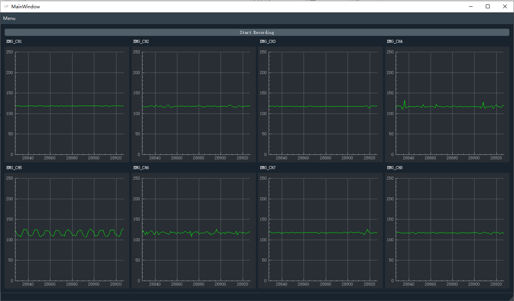

# oym8CHWave

Open source EMG data manipulation tool for gForcePro/gForcePro+.
Displays waveforms according to EMG data from gForcePro. Sends sound on/off bit flags to oym8CHWaveArduino if oym8CHWaveArduino is connected.

***

## Screenshots

***

## Download

Software download [click here](../../../assets/downloads/gForce/oym8CHWave.zip){: target="_blank"}, user guide download [click here](../../../assets/downloads/gForce/oym8CHWaveUserGuide.pdf){: target="_blank"}

***

## Source code

View source code [click here](https://github.com/oymotion/oym8CHWave){: target="_blank"}
