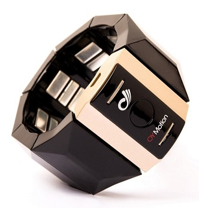
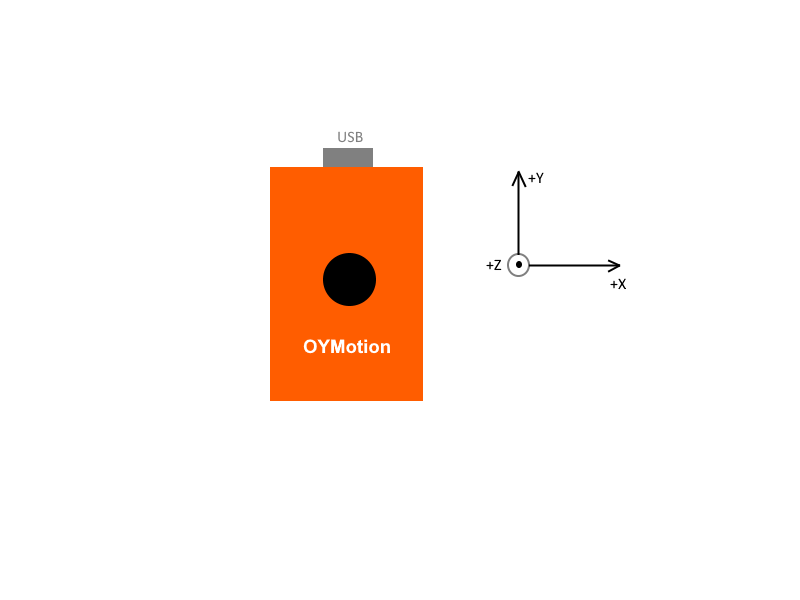

# gForce 200 Armband User Guide

Nov 16th, 2020

***

## Overview

gForce 200 Armband is a smart wearable [Human Interface Device][HID] for
[gesture recognition][GestureRecognition]. It recognizes gestures according
to the sEMG signals of human forearms, and as well as calculates orientation
data in quaternions or [Euler Angles][EulerAngles] from its built-in 9-axis
[IMU][IMU].

Comparing with the other gesture recognition devices that are based on
the computer vision technology, gForce Armband has the advantage of no
dependency of ambient light, no strictness with angle, much lower energy
and much lower cost.

## Turning on/off

- Turn on

    When gForce 200 Armband is off, its green LED light will be off. To turn
    it on, simply press and hold the button in the middle of its main block for
    about 1 second til the green LED is turned on.

    When gForce 200 Armband starts to power on, it will vibrate for about 0.2
    second. Once it is successfully powered up, the green LED light flashes
    at a frequency of 1/4HZ with 2 seconds on and 2 seconds off.

    Make sure the armband has sufficient power, otherwise re-charge it with
    a micro USB line.

- Turn off

    When gForce 200 Armband is on, pressing and holding the button for about 5
    seconds and then releasing will turn it off. The green LED being off
    indicates the device has been turned off successfully.

**Note**:
> If gForce 200 Armband is not in use, please turn it off. Right now the
> auto-low-power mode is not implemented yet.

## Re-charging

gForce 200 Armband is equipped with Li-ion battery (200mAh). The USB port on
the main block is used for battery re-charging.

During re-charging, the red light LED on the main block is on. Re-charging will maximally take 2 hours, and after re-charging completes, the red light LED is turned off.

**Note**:
>gForce 200 Armband is NOT designed to work during re-charging, as this brings in
>electrical noise which contaminates the weak EMG biometric signals.

## Other Status Indication

- After successfully connecting with a BLE central device (e.g. gForceJoint,
  gForceDongle or any other BLE central device), the green LED light flashes
  at 5HZ when any data (e.g. quaternion, gesture or raw data) switch is on.

- The device will vibrate for about 200ms when a gesture is recognized.

## Instructions to Wearing and Performing Gestures

To make sure gForce armband can recognize your gestures, please refer to
[Guide to Performing Gestures][GuideToPerformingGestures] and spend several minutes learning and training yourself. The recognition rate can reach 95% and even higher after you get familiar with performing the gestures properly.

## IMU

When power on, the IMU directions are like this:

But it will be reset when you press the multi-function button. You may view IMU data in [gForce APP](../APPs/gForceApp.md).

## Predefined Gestures

The six predefined gestures are:

- _Fist_
- _Spread Fingers_
- _Wave In_
- _Wave Out_
- _Pinch_
- _Shoot_

**Note**:
> When both your arm and hand are at a rest state, it will be recognized as a
> '_Relax_' gesture.

## Fetch Gesture/Quaternion/IMU Data

For data fetch, we offer SDK:
Use [gForceSDKCXX](https://github.com/oymotion/gForceSDKCXX), [gForceSDKCSharp](https://github.com/oymotion/gForceSDKCSharp), [gForceSDKPython](https://github.com/oymotion/gForceSDKPython) to fetch gesture/quaternion/IMU data, etc.
See [SDK list](../SDK/SDKList.md) & [gForceSDK manual](../SDK/gForceSDK.md) for help.

***

## User Guide

[Click here](../assets/downloads/gForce-EMG-ARMBAND-User-Guide-202108.pdf) for gForce200 user guide in PDF format.

[HID]: https://en.wikipedia.org/wiki/Human_interface_device
[GestureRecognition]: https://en.wikipedia.org/wiki/Gesture_recognition
[EulerAngles]: https://en.wikipedia.org/wiki/Euler_angles
[IMU]: https://en.wikipedia.org/wiki/Inertial_measurement_unit
[GuideToPerformingGestures]: https://www.youtube.com/watch?v=wBsYJf0wrkk
