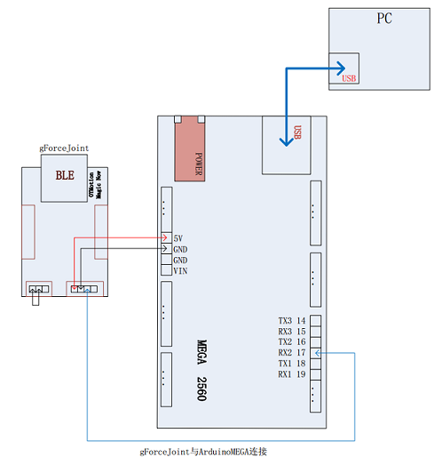
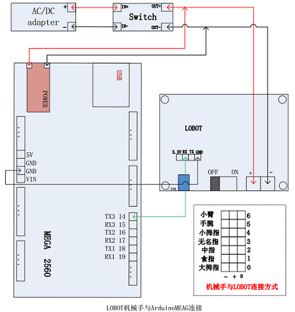
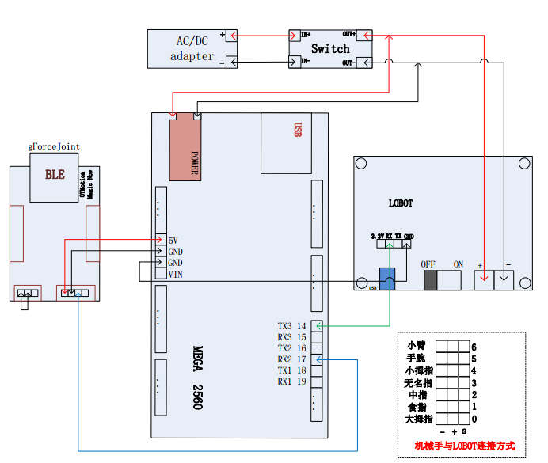

# 简介
该文档用于介绍如何通过gForce控制LoBot机械手。    
在阅读后续文档内容之前，请确保您已经`熟悉`[Arduino](https://www.arduino.cc/),并已经
安装[ArduinoIDE](https://www.arduino.cc/en/Main/Software)。

* [什么是Arduino](https://www.arduino.cc/en/Guide/Introduction)
* [如何安装ArduinoIDE](https://www.arduino.cc/en/Main/Software)   
* [学习Arduino](https://www.arduino.cc/en/Reference/HomePage)   

# 如何使用gForce控制LoBot机械手
本章节开始详细介绍如何使用gForce控制LoBot机械手，在后续章节中会反复使用`gForceJoint`/
`gForce`/`gForceSDKArduino`/`ArduinoMEGA`这些名词，具体解释请参考链接。

* [什么是gForce][gForce]      
* [什么是gForceJoint][gForceJoint]   
* [什么是gForceSDKArduino][gForceSDKArduino]   
* [什么是ArduinoMEGA](https://www.arduino.cc/en/Main/arduinoBoardMega)   

## 导入gForceSDKArduino   

* [如何导入gForceSDKArduino](https://github.com/oymotion/gForceSDKArduino)

## gForceJoint与ArduinoMEGA的通讯测试

1. 如上图所示，连接gForceJoint与ArduinoMEGA
2. 使用ArduinoIDE打开
[gForceJointTest][gForceJointTest]工程，并更新ArduinoMEGA的固件.**(选择`“项目”->“上传”`更新固件)**
3. 打开ArduinoIDE里的`串口监视器`.**(选择`“工具”->“串口监视器”`打开串口监视器)**
4. 设置串口监视器波特率为115200bps
5. 将gForce连接到gForceJoint上，然后做出相应的手势，通过`串口监视器`内打印的数据判断是否通讯正常   

* [如何使gForce与gForceJoint建立连接][How to connect gForce and gForceJoint]

如果gForceJoint与ArduinoMEGA通讯正常，则继续进行后续章节，否则需要找到并解决通讯失败的问题。

> 1. gForceJoint与ArduinoMEAG连线错误，gForce与gForceJoint未正常连接等可能导致通讯失败

## Lobot机械手测试

1. 如上图所示连接LOBOT与ArduinoMEAG
2. 将ArduinoMEAG与PC通过USB线连接，打开
[LobotTest][LobotTest]工程，并更新ArduinoMEAG的固件 **(选择`“项目”->“上传”`更新固件)**
3. 观察Lobot机械手的手势是否正确

如果Lobot机械手的手势不正常，则需要找到并解决该问题，然后在进行下一章节。
>1. Lobot与ArduinoMEAG连线错误，电池电量不足，及机械手与LOBOT连线方式有误都可能会导致机械手手势错误

## gForce与Lobot机械手连接调试

1. 如上图所示，连接相应的开发板
2. 将ArduinoMEAG与PC连接，打开[LobotControlBygForce][LobotControlBygForce]
工程，并更新ArduinoMEAG固件 **(选择`“项目”->“上传”`更新固件)**
3. 将gForce与gForceJoint进行连接，试玩机械手的控制。

# gForce相关视频
该小节用于介绍如何做好gForce定义的手势及相关gForce应用视频，参考标准手势能够显著提高手势识别率。

* [如何做好gForce定义手势](http://video.tudou.com/v/XMjQ2NjgxNzE1Mg==.html)   
* [OYMotion肌电智能义肢](http://video.tudou.com/v/XMjc5NjQzNTUzNg)   

# 问题反馈
在使用过程中有任何问题，欢迎邮件反馈。   
* 邮件:info@oymotion.com

[gForce]:https://oymotion.github.io/gForce100/gForce100UserGuide/
[gForceJoint]:https://oymotion.github.io/gForceEmbeddedSuit/gForce100EmbeddedSuiteUserGuide/#overview
[How to connect gForce and gForceJoint]:https://oymotion.github.io/gForceEmbeddedSuit/gForce100EmbeddedSuiteUserGuide/#connecting-gforce-with-gforcejoint   
[gForceJointTest]:https://github.com/oymotion/gForceExample/blob/master/LobotControlBygForce/project/gForceJointTest/gForceJointTest.ino
[LobotTest]:https://github.com/oymotion/gForceExample/blob/master/LobotControlBygForce/project/LobotTest/LobotTest.ino
[LobotControlBygForce]:https://github.com/oymotion/gForceExample/blob/master/LobotControlBygForce/project/LobotControlBygForce/LobotControlBygForce.ino
[gForceSDKArduino]:(https://github.com/oymotion/gForceSDKArduino)
