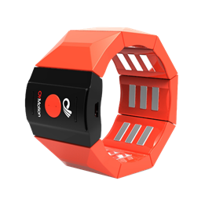

# gForceBLE Armband User Guide

August 28th, 2020

## Overview

gForceBLE Armband is a smart wearable [Human Interface Device][HID] for
[gesture recognition][GestureRecognition]. It recognizes gestures according
to the sEMG signals of human forearms, and as well as calculates orientation
data in quaternions or [Euler Angles][EulerAngles] from its built-in 9-axis
[IMU][IMU].

Comparing with the other gesture recognition devices that are based on
the computer vision technology, gForce Armband has the advantage of no
dependency of embient light, no strictness with angle, much lower energy
and much lower cost.

## Turning on/off

- Turn on

    When gForceBLE Armband is off, its green LED light will be off. To turn
    it on, simply press the button in the middle of its main block.

    When gForceBLE Armband starts to power on, it will vibrate for about 0.5
    second. Once it is successfully powered up, the green LED light flashes
    at a frequency of 4HZ with 2 seconds on and 2 seconds off.

    Make sure the armband has sufficient power, otherwise re-charge it with
    a micro USB line.

- Turn off

    When gForceBLE Armband is on, pressing and holding the button for about 5
    seconds and then releasing will turn it off. The green LED being off
    indicates the device has been turned off successfully.

**Note**:
> If gForceBLE Armband is not in use, please turn it off. Right now the
> auto-low-power mode is not implemented yet.

## Re-charging

gForceBLE Armband is equipped with Li-ion battery (200mAh). The USB port on
the main block is used for battery re-charging.

During re-charging, the red light LED on the main block is on. Re-charging will maximally take 2 hours, and after re-charging completes, the red light LED is turned off.

**Note**:
>gForceBLE Armband is NOT designed to work during re-charging, as this brings in
>electrical noise which contaminates the weak EMG biometric signals.

## Other Status Indication

- After successfully connecting with a BLE central device (e.g. gForceJoint,
  gForceDongle or any other BLE central device), the green LED light flashes
  at 5HZ when any data (e.g. quaternion, gesture or raw data) switch is on.

- The device will vibrate for about 100ms when a gesture is recognized.
  

## Gesture Training

gForceBLE supports user gesture training with help of OTrain desktop APP.

Refer to [OTrain](../APPs/OTrain.md) for more details.

## Fetch EMG/Qurternion/... Data

* Via App
  gForceAPP For Android: Armband Gesture and Quaternion Real-time Check. [click here download](https://oymotion.github.io/assets/downloads/gForceApp_v2.3.4-20171009.apk)

* Via SDK
  Use [gForceSDKCXX](https://github.com/oymotion/gForceSDKCXX), [gForceSDKCSharp](https://github.com/oymotion/gForceSDKCSharp), [gForceSDKPython](https://github.com/oymotion/gForceSDKPython) to fetch EMG data, etc.
  See [SDK list](../gForceSDK/SDKList.md) & [gForceSDK manual](../gForceSDK/gForceSDK.md) for help.

* Via oym8CHWave
  Refer to [oym8CHWave](../APPs/oym8CHWave.md) for more details.

[HID]: https://en.wikipedia.org/wiki/Human_interface_device
[GestureRecognition]: https://en.wikipedia.org/wiki/Gesture_recognition
[EulerAngles]: https://en.wikipedia.org/wiki/Euler_angles
[IMU]: https://en.wikipedia.org/wiki/Inertial_measurement_unit