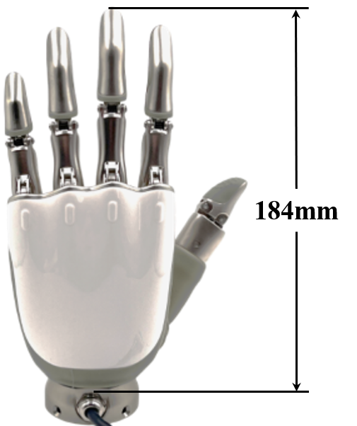
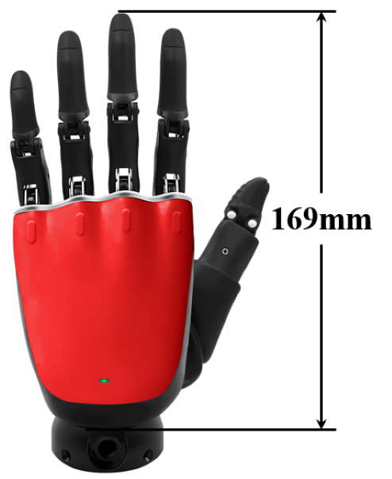
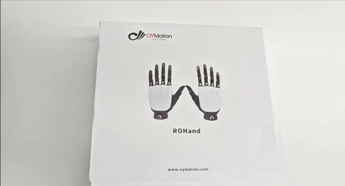
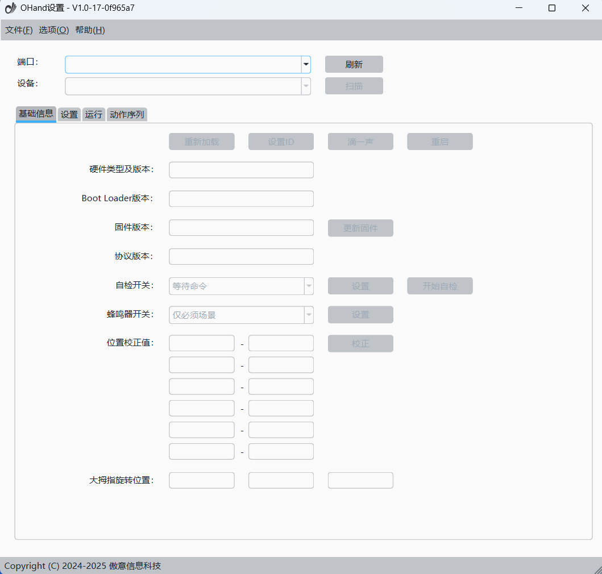

# ROHand 灵巧手

## 概述

ROHAND 灵巧手共有 11 个运动关节，内置 6 个电机驱动器和电机控制电路。具有 6 个主动自由度，并内置 PID 电机控制算法，该手可以模拟人手实现多种抓握手势。典型应用包括机器人末端执行器、教育与科研设备、仿生假肢等。

ROHand 灵巧手提供 UART、RS485([下载驱动](https://www.wch.cn/downloads/CH341SER_EXE.html){: target="_blank"}) 或 CAN([下载驱动](https://peak-system.com.cn/driver/){: target="_blank"}) 物理接口，支持 SerialCtrl 专用串行协议、ModBus-RTU 协议和 CAN 协议，可为 ROS / ROS2 平台提供二次开发 SDK。目前分为以下版本：

|          ***ROH-A001/ROH-A002***          |          ***ROH-AP001***           |          ***ROH-AP002***           |            ***ROH-LiteS001***            |
| :---------------------------------------: | :--------------------------------: | :--------------------------------: | :--------------------------------------: |
|  |  |  |  |

## 开箱使用

|                                            RS485                                             |                                           CAN                                            |
| :------------------------------------------------------------------------------------------: | :--------------------------------------------------------------------------------------: |
| {: target="_blank"} | {: target="_blank"} |

## 上位机软件

[<u>Windows</u>](../../assets/downloads/ROHand/OHandSetting-Windows.zip)

[<u>Ubuntu22</u>](../../assets/downloads/ROHand/OHandSetting-Ubuntu22.zip)

[<u>Ubuntu24</u>](../../assets/downloads/ROHand/OHandSetting-Ubuntu24.zip)

## 上位机使用手册

[<u>查看</u>](../../assets/downloads/ROHand/OHandSetting使用手册.pdf){: target="_blank"}

## 上位机视频教程

{: target="_blank"}
