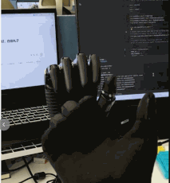
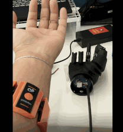

# ROH-Gen1-Demos  适用于ROH-A001/A002 和 ROH-LiteS001

## Demo获取

- 方法一: [点击此链接](../../../assets/downloads/ROHand/roh_demos-main.zip)下载

- 方法二: 访问[roh_demos](https://github.com/oymotion/roh_demos){: target="_blank"} github网址下载最新版本  

- 方法三: 通过clone获取:  

    ```Bash
    git clone https://github.com/oymotion/roh_demos
    ```

## Demo运行教程(windows系统)

ROHand的Demo是基于python脚本开发的, 以下为windows系统使用教程:  

- 当前支持的ROHand的有ROH-A001、ROH-A002和ROH-LiteS001系列.  

- Demo目前有三种控制方式: 视觉控制, 手套控制 和 gForce肌电臂环.

### 1. 安装python3.12.4

安装前请确保主机用户名为英文  

[点击此处](https://www.python.org/downloads/release/python-3124/){: target="_blank"} 从官网获取python3.12.4  
或[点击此处](../../../assets/downloads/ROHand/python-3.12.4-amd64.exe) 直接下载安装包  

双击exe打开python安装程序,安装前请务必勾选下图中选项  

  
点击Install Now  

安装完成后可打开命令行查询是否安装成功  

```Bash
python --version
```

若安装成功控制台会打印Python 3.12.4  

### 2. 安装CH341SER驱动

[点击此处](../../../assets/downloads/ROHand/CH341SER.EXE)获取CH341SER驱动  

双击exe打开CH341SER安装程序  

点击安装即可  

### 3. 创建虚拟环境（可选）

使用虚拟环境可以保证安装demo所需依赖后不影响其他环境  

```Bash
pip install virtualenv

# 选择任意您想配置虚拟环境的位置
cd path/to/your/folder

# 创建虚拟环境，name为虚拟环境名，可自行更改
virtualenv name

# 启动虚拟环境
.\name\Scripts\activate.bat
```

### 4. 安装所需依赖

#### 4.1 glove_ctrled_rohand

手套控制灵巧手demo, 在安装bleak-winrt时，需要额外安装vs_BuildTools  

[点击此处](../../../assets/downloads/ROHand/vs_BuildTools.exe)获取vs_BuildTools  

双击exe打开Visual Studio Installer  

以win11为例，如图勾选需要的安装包(必选),其他可按您的需求勾选  

  

勾选完毕后点击安装即可  

安装完后在控制台输入：  

```Bash
cd /path/to/demo/glove_ctrled_rohand
pip install -r requirements.txt
```

安装完成后输入  

```Bash
python glove_ctrled_hand.py
```

即可启动demo  

程序将自动识别您使用的是有线或无线手套

<span style="background-color: #f0f0f0; color: red; padding: 2px 4px; border-radius: 2px;"> **注意事项:** </span>

- **手套使用前需要校准，运行程序后保持手掌张开-握拳-张开重复动作直到校准完成即可，校准时尽量保持放松，避免手指伸的太直或握的太紧，会影响校准结果和控制精度.**  

#### 4.2 gesture_ctrled_rohand

```Bash
cd /path/to/demo/gesture_ctrled_rohand
pip install -r requirements.txt
```

安装完成后输入  

```Bash
python gesture_ctrled_hand.py
```

即可启动demo  

<span style="background-color: #f0f0f0; color: red; padding: 2px 4px; border-radius: 2px;"> **注意: 视觉demo只可以识别手掌面对摄像头且手指向上的手势，其他姿势可能会导致识别不准确.** </span> 

#### 4.3 gForce_ctrled_rohand

```Bash
cd /path/to/demo/gForce_ctrled_rohand
pip install -r requirements.txt
```

安装完成后输入  

```Bash
python gForce_ctrled_hand.py
```

即可启动demo  

注意此demo需要搭配gForce臂环APP，在APP端训练手势后使用.  

## Demo运行教程(ubuntu系统)

ubuntu通常自带python，无需另行下载  

### 1. 卸载brltty

ubuntu无需安装341驱动  

<span style="background-color: #f0f0f0; color: red; padding: 2px 4px; border-radius: 2px;">**但是需要卸载brltty，此依赖会导致串口异常占用**  </span>

```Bash
sudo apt remove brltty
```

### 2. 检查是否识别到灵巧手并添加权限

插入灵巧手后  

```Bash
ls /dev/ttyUSB*
```

控制台打印/dev/ttyUSB0  

给串口添加权限  

```Bash
sudo chmod o+rw /dev/ttyUSB0
```

### 3. 创建虚拟环境（可选）

使用虚拟环境可以保证安装demo所需依赖后不影响其他环境  

```Bash
pip3 install virtualenv

# 选择任意您想配置虚拟环境的位置,name为虚拟环境的名称,可自由更改
cd path/to/your/folder

# 创建虚拟环境，name为虚拟环境名，可自行更改
virtualenv name

# 启动虚拟环境
source name/bin/activate
```

### 4. 安装所需依赖

#### 4.1 glove_ctrled_rohand

```Bash
cd path/to/demo/glove_ctrled_rohand
pip3 install -r requirements.txt
```

```Bash
# 连接到Modbus设备
client = ModbusSerialClient(self.find_comport("CH340") or self.find_comport("USB"), FramerType.RTU, 115200)
if not client.connect():
    print("连接Modbus设备失败\nFailed to connect to Modbus device")
    exit(-1)
```

替换self.find_comport("CH340")为"/dev/ttyUSB0"  

```Bash
# 连接到Modbus设备
client = ModbusSerialClient("/dev/ttyUSB0" or self.find_comport("USB"), FramerType.RTU, 115200)
if not client.connect():
    print("连接Modbus设备失败\nFailed to connect to Modbus device")
    exit(-1)
```

<span style="background-color: #f0f0f0; color: red; padding: 2px 4px; border-radius: 2px;"> **注意事项: 请检查您的手套是蓝牙版还是有线版** </span>

- **若您使用有线版，插入手套并启动后请检查**  

```Bash
ls /dev/ttyACM*
```

是否打印了/dev/ttyACM0  

若有的话请添加此串口的权限  

```Bash
sudo chmod o+rw /dev/ttyACM0
```

完成后输入：  

```Bash
python3 glove_ctrled_hand.py
```

即可运行demo  

<span style="background-color: #f0f0f0; color: red; padding: 2px 4px; border-radius: 2px;"> **注意: 手套使用前需要校准，运行程序后保持手掌张开-握拳-张开重复动作直到校准完成即可，校准时尽量保持放松，避免手指伸的太直或握的太紧，会影响校准结果和控制精度.** </span>

#### 4.2 gesture_ctrled_rohand

```Bash
cd /path/to/demo/gesture_ctrled_rohand
pip install -r requirements.txt
```

安装完成后同样需要修改串口  

```Bash
client = ModbusSerialClient(find_comport("CH340") or find_comport("USB"), FramerType.RTU, 115200)
```

158行处修改find_comport("CH340")为"/dev/ttyUSB0"  

```Bash
client = ModbusSerialClient("/dev/ttyUSB0" or find_comport("USB"), FramerType.RTU, 115200)
```

随后输入：  

```Bash
python gesture_ctrled_hand.py
```

即可启动demo  

<span style="background-color: #f0f0f0; color: red; padding: 2px 4px; border-radius: 2px;"> **注意: 视觉demo只可以识别手掌面对摄像头且手指向上的手势，其他姿势可能会导致识别不准确.** </span>

#### 4.3 gForce_ctrled_rohand

```Bash
cd /path/to/demo/gForce_ctrled_rohand
pip install -r requirements.txt
```

同理修改串口  

```Bash
client = ModbusSerialClient(find_comport("CH340") or find_comport("USB"), FramerType.RTU, 115200)
```

126行处修改find_comport("CH340")为"/dev/ttyUSB0"  

```Bash
client = ModbusSerialClient("/dev/ttyUSB0" or find_comport("USB"), FramerType.RTU, 115200)
```

完成后输入  

```Bash
python gForce_ctrled_hand.py
```

即可启动demo  

<span style="background-color: #f0f0f0; color: red; padding: 2px 4px; border-radius: 2px;"> **注意: 此demo需要搭配gForce臂环APP，在APP端训练手势后使用.** </span>

## Demo运行实例

### 1. gesture_ctrled_rohand


### 2. glove_ctrled_rohand



### 3. gForce_ctrled_rohand


