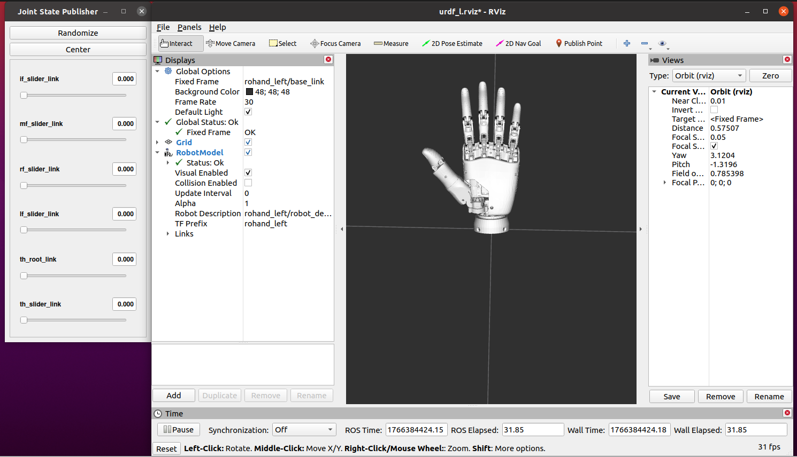
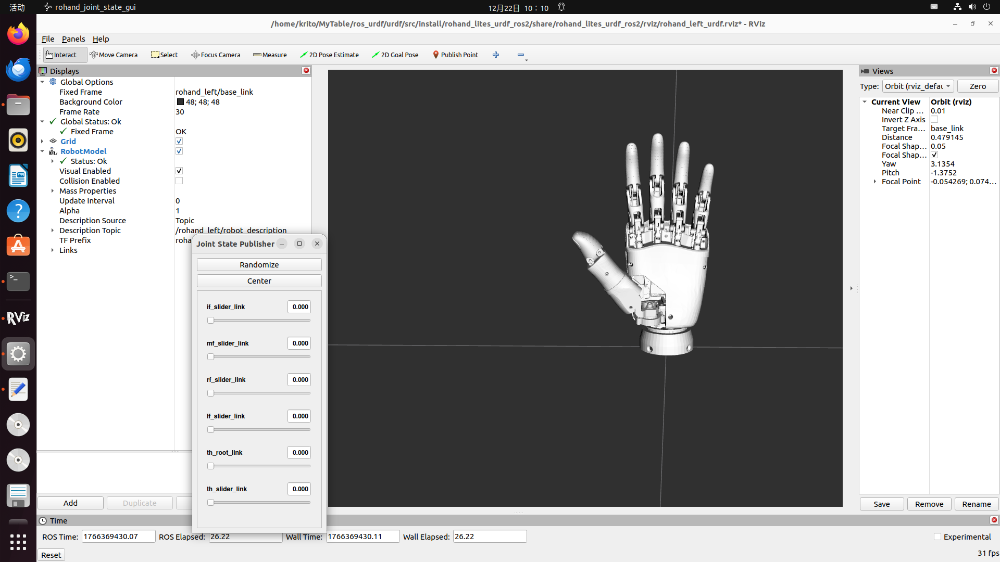
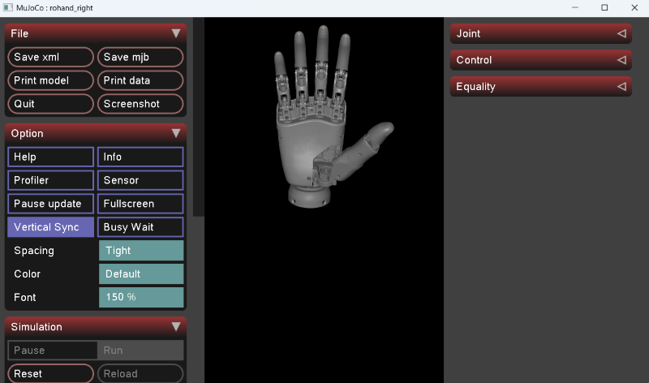

# ROH-LiteS001

## 用户手册

[<u>ROH-LiteS001 用户手册</u>](https://www.oymotion.com/upload/files/20251024145240ROH-LiteS001%E6%9C%BA%E5%99%A8%E4%BA%BA%E7%81%B5%E5%B7%A7%E6%89%8B-V1.0.5.pdf){: target="_blank"}

## 通讯协议

[Serial&CAN](../ROH-Protocols/OHandSerialProtocol_Gen2.md)

[Modbus](../ROH-Protocols/OHandModBusRTUProtocol_Gen2.md)

## ROS1 开发包

ROHand的ROS1支持是基于[rohand_ros_pkg](https://github.com/oymotion/rohand_ros_pkg){: target="_blank"} 功能包进行的, 以下为使用环境:  

- 当前支持的ROHand系列的有: ROH-A001, ROH-A002, ROH-LiteS001, ROH-AP001, 和 ROH-AP002.  

- ROS1支持Ubuntu版本: 20.04(Noetic)  

- ROHand支持节点: ModBus-RTU , SerialCtrl 和 teleop(仅调试时用)  

安装ros1环境详情请访问[fishros](https://fishros.org.cn/forum/topic/20/%E5%B0%8F%E9%B1%BC%E7%9A%84%E4%B8%80%E9%94%AE%E5%AE%89%E8%A3%85%E7%B3%BB%E5%88%97){: target="_blank"}

### 1. 安装ROS1环境

使用一键安装指令安装ros1并选择支持的版本.  

```Bash
wget http://fishros.com/install -O fishros && . fishros
```

### 2. 下载 rohand_ros_pkg

- 方法一: [点击此链接](../../../assets/downloads/ROHand/rohand_ros_pkg-main.zip)下载

- 方法二: 访问[rohand_ros_pkg](https://github.com/oymotion/rohand_ros_pkg){: target="_blank"} github网址下载最新版本  

- 方法三: 通过clone获取:  

    ```BASH
    cd ~
    mkdir -p ros_ws/src
    cd ros_ws/src
    git clone ssh://git@github.com/oymotion/rohand_ros_pkg
    ```

### 3. 运行ros1项目

请访问[ROS1 README](../ROS/ROS1.md)获取更多信息.

## ROS2 开发包

ROHand的ROS2支持是基于[rohand_ros2_pkg](https://github.com/oymotion/rohand_ros2_pkg){: target="_blank"} 功能包进行的, 以下为使用环境:  

- 当前支持的ROHand的有ROH-A001、ROH-A002、ROH-LiteS001、ROH-AP001、ROH-AP002系列.  

- ROS2支持Ubuntu版本: 22.04(humble或rolling).  

- ROHand支持节点: ModBus-RTU , SerialCtrl 和 teleop(仅调试时用)  

安装ros2环境详情请访问[鱼香ros](https://fishros.org.cn/forum/topic/20/%E5%B0%8F%E9%B1%BC%E7%9A%84%E4%B8%80%E9%94%AE%E5%AE%89%E8%A3%85%E7%B3%BB%E5%88%97){: target="_blank"} .

### 1. 安装ROS2环境

使用一键安装指令安装ros2并选择支持的版本.  

```Bash
wget http://fishros.com/install -O fishros && . fishros
```

### 2. 下载rohand_ros2_pkg

- 方法一: [点击此链接](../../../assets/downloads/ROHand/rohand_ros2_pkg-main.zip)下载

- 方法二: 访问[rohand_ros2_pkg](https://github.com/oymotion/rohand_ros2_pkg){: target="_blank"} github网址下载最新版本  

- 方法三: 通过clone获取:  

    ```BASH
    cd ~
    mkdir -p ros2_ws/src
    cd ros2_ws/src
    git clone ssh://git@github.com/oymotion/rohand_ros2_pkg
    ```

### 3. 运行ros2项目

请访问[ROS2 README](../ROS/ROS2.md)获取更多信息.

## URDF ROS1

ROHand的ROS1支持是基于[rohand_lites_urdf_ros1](https://github.com/oymotion/rohand_lites_urdf_ros1){: target="_blank"} 功能包进行的, 以下为使用环境:  

- 当前支持的ROHand系列的有: ROH-LiteS001.  

- ROS1支持Ubuntu版本: 20.04(Noetic)  

- ROHand支持节点: ModBus-RTU , SerialCtrl 和 teleop(仅调试时用)  

安装ros1环境详情请访问[fishros](https://fishros.org.cn/forum/topic/20/%E5%B0%8F%E9%B1%BC%E7%9A%84%E4%B8%80%E9%94%AE%E5%AE%89%E8%A3%85%E7%B3%BB%E5%88%97){: target="_blank"}

### 1. 安装ROS1环境

使用一键安装指令安装ros1并选择支持的版本.  

```Bash
wget http://fishros.com/install -O fishros && . fishros
```

### 2. 下载 rohand_lites_urdf_ros1

- 方法一: [点击此链接](../../../assets/downloads/ROHand/rohand_lites_urdf_ros1-main.zip)下载

- 方法二: 访问[rohand_lites_urdf_ros1](https://github.com/oymotion/rohand_lites_urdf_ros1){: target="_blank"} github网址下载最新版本  

- 方法三: 通过clone获取:  

    ```BASH
    cd ~
    mkdir -p ros_ws/src
    cd ros_ws/src
    git clone ssh://git@github.com/oymotion/rohand_lites_urdf_ros1
    ```

### 3. 运行URDF ros1项目

请访问[URDF README](../ROS/LITES_URDF_ROS1.md)获取更多信息.  

运行成功界面截图所示:  



## URDF ROS2

ROHand的ROS2支持是基于[rohand_lites_urdf_ros2](https://github.com/oymotion/rohand_lites_urdf_ros2){: target="_blank"} 功能包进行的, 以下为使用环境:  

- 当前支持的ROHand的有ROH-LiteS001.  

- ROS2支持Ubuntu版本: 22.04(humble或rolling).  

- ROHand支持节点: ModBus-RTU , SerialCtrl 和 teleop(仅调试时用)  

安装ros2环境详情请访问[鱼香ros](https://fishros.org.cn/forum/topic/20/%E5%B0%8F%E9%B1%BC%E7%9A%84%E4%B8%80%E9%94%AE%E5%AE%89%E8%A3%85%E7%B3%BB%E5%88%97){: target="_blank"} .

### 1. 安装ROS2环境

使用一键安装指令安装ros2并选择支持的版本.  

```Bash
wget http://fishros.com/install -O fishros && . fishros
```

### 2. 下载rohand_lites_urdf_ros2

- 方法一: [点击此链接](../../../assets/downloads/ROHand/rohand_lites_urdf_ros1-main.zip)下载

- 方法二: 访问[rohand_lites_urdf_ros2](https://github.com/oymotion/rohand_lites_urdf_ros2){: target="_blank"} github网址下载最新版本  

- 方法三: 通过clone获取:  

    ```BASH
    cd ~
    mkdir -p ros2_ws/src
    cd ros2_ws/src
    git clone ssh://git@github.com/oymotion/rohand_lites_urdf_ros2
    ```

### 3. 运行URDF ros2项目

请访问[URDF README](../ROS/LITES_URDF_ROS2)获取更多信息.  

运行成功界面截图所示:  



## Python示例程序

本示例程序旨在为傲意灵巧手的二次开发提供便捷的Python接口与示例代码.通过示例程序,用户能够轻松实现对灵巧手的控制,从而加速灵巧手相关应用的开发过程.

### 支持的操作系统与软件版本

#### 操作系统

- Windows: 支持windows 10/11 操作系统下64位版本  

- Linux: 支持Linux操作系统的x64架构和arm架构  

#### 软件版本

- Python: 3.12版本及以上

### 下载示例程序

- 方法一: [点击此链接](../../../assets/downloads/ROHand/roh_demos-main.zip)下载

- 方法二: 访问[roh_demos](https://github.com/oymotion/roh_demos){: target="_blank"} github网址下载最新版本  

- 方法三: 通过以下命令获取python示例demo.  

    ```Bash
    git clone https://github.com/oymotion/roh_demos
    ```

### 使用

安装完成后,用户可以在各示例项目下找到README.md文件,里面详细介绍了如何安装所需的运行环境与如何运行示例程序.

### 示例程序介绍

#### 1. gesture_ctrled_rohand

该示例通过电脑摄像头对傲意灵巧手的手势识别,使其能够根据识别到的手势去控制灵巧手

#### 2. gForce_ctrled_rohand

该示例通过肌电手环gForce系列, 根据已经训练好的手势模型, 对灵巧手做出不同的动作控制.

gForce APP 手环训练请参考[<u>此文件</u>](../../assets/downloads/gForce/gForceAPP使用说明书_202403.pdf){: target="_blank"}. 目标: 训练并应用模型

#### 3.glove_ctrled_rohand

该示例通过无线蓝牙手套或有线手套控制灵巧手的运动.

#### 4.loop_test

该示例实现了灵巧手的循环动作测试, 观察灵巧手的运动是否正常.

## SDK C/C++

### 下载SDK C/C++

- 方法一: [点击此链接](../../../assets/downloads/ROHand/ohand_serial_sdk-master.zip)下载

- 方法二: 访问[ohand_serial_sdk](https://github.com/oymotion/ohand_serial_sdk){: target="_blank"} github网址下载最新版本  

- 方法三: 通过clone获取:  

    ```Bash
    git clone https://github.com/oymotion/ohand_serial_sdk
    ```

### SDK C/C++指南

[点击此处](../SDK/ROH_SDK_CXX.md) 获取更多信息

## SDK Python

### 下载SDK Python

- 方法一: [点击此链接](../../../assets/downloads/ROHand/ohand_serial_sdk_python-main.zip)下载

- 方法二: 访问[ohand_serial_sdk_python](https://github.com/oymotion/ohand_serial_sdk_python){: target="_blank"} github网址下载最新版本  

- 方法三: 通过clone获取:  

    ```Bash
    git clone https://github.com/oymotion/ohand_serial_sdk_python
    ```

### SDK Python指南

[点击此处](../SDK/ROH_SDK_Python.md) 获取更多信息

## Mujoco

### 环境

- 系统: Windows 10/11 与 ubuntu20.04及以上  
- 模块: mujoco

### 下载Mujoco项目

- 方法一: [点击此链接](../../../assets/downloads/ROHand/LiteS001_mujoco.zip)下载

- 方法二: 访问[rohand_mujoco](https://github.com/oymotion/rohand_mujoco){: target="_blank"} github网址下载最新版本  

- 方法三: 通过clone获取:  

    ```Bash
    git clone https://github.com/oymotion/rohand_mujoco
    ```

### 运行

```bash
python main.py
```

[点击此处](../MUJOCO/LiteS.md) 获取更多信息  

运行成功时应如图所示:  

