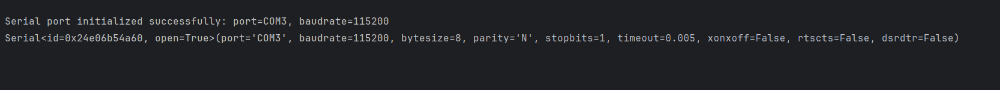

# 👉 SDK Python

## 👉引言

本开发包旨在为傲意灵巧手的二次开发提供便捷的Python接口，通过本开发包，用户能够了解支持设备连接、数据采集、手势控制等功能，加速灵巧手相关应用的开发过程。

## 👉支持的操作系统与软件版本

- ### 操作系统

Windows（64位和32位）：支持Windows操作系统下的64位和32位版本，方便Windows用户进行灵巧手开发。
Linux（x86和arm）：支持Linux操作系统的x86架构和arm架构，满足不同硬件环境的需求。

- ### 软件版本  

Python 3.12以上：本开发包基于Python 3.12及以上版本进行开发，确保与最新Python版本的兼容性。

## 👉安装与使用  

- ### 安装

本地下载二次开发包：  

- 方法一: [点击此链接](../../../assets/downloads/ROHand/ohand_serial_sdk_python-main.zip)下载

- 方法二: 访问[ohand_serial_sdk_python](https://github.com/oymotion/ohand_serial_sdk_python){: target="_blank"} github网址下载最新版本  

- 方法三: 通过clone获取:  

    ```Bash
    git clone https://github.com/oymotion/ohand_serial_sdk_python
    ```

- ### 使用  

安装完成后，用户可以在Python脚本中导入开发包并使用相关API接口进行灵巧手的开发工作。以下是一个简单的使用灵巧手Python开发包连接灵巧手的主要代码（可在simple_control.py文件中找到）：  

```python
def main():
    interface_instance = None
    ohand_instance = None
    if PORT_TYPE == PORT_UART:
        interface_instance = Serial_Init(port_name=find_comport("CH340") or find_comport("Serial"), baudrate=115200)
    else:
        interface_instance = CAN_Init(port_name="1", baudrate=1000000)

    if interface_instance is None:
        print("Port init failed\n")
        return

    ohand_instance = OHandSerialAPI(interface_instance, HAND_PROTOCOL_UART, ADDRESS_MASTER,
                                           send_data_impl, recv_data_impl)

    ohand_instance.HAND_SetTimerFunction(get_milli_seconds_impl, delay_milli_seconds_impl)
    ohand_instance.HAND_SetCommandTimeOut(255)
    print(ohand_instance.get_private_data(), "\n")
```

输出结果如下所示：  



## 👉错误返回值定义

<link rel="stylesheet" href="https://cdnjs.cloudflare.com/ajax/libs/highlight.js/11.7.0/styles/github.min.css">
<script src="https://cdnjs.cloudflare.com/ajax/libs/highlight.js/11.7.0/highlight.min.js"></script>

<div style="position: relative;">
  <button onclick="copyCode(this)" style="position: absolute; right: 8px; top: 8px; background: #6c757d; color: white; border: none; padding: 4px 8px; border-radius: 3px; cursor: pointer; font-size: 12px; z-index: 10;">
    复制
  </button>
  <pre><code class="language-python">HAND_RESP_HAND_ERROR: Final = 0xFF               # 设备错误，错误回调将被调用，并附带上述OHand错误码  
HAND_RESP_SUCCESS: Final = 0x00
HAND_RESP_TIMER_FUNC_NOT_SET: Final = 0x01       # 本地错误：定时器函数未设置，请先调用 HAND_SetTimerFunction(...)  
HAND_RESP_INVALID_CONTEXT: Final = 0x02          # 本地错误：无效上下文，空指针或发送数据函数未设置  
HAND_RESP_TIMEOUT: Final = 0x03                  # 本地错误：等待节点响应超时  
HAND_RESP_INVALID_OUT_BUFFER_SIZE: Final = 0x04  # 本地错误：输出缓冲区大小与返回数据不匹配  
HAND_RESP_UNMATCHED_ADDR: Final = 0x05           # 本地错误：返回的节点ID与等待中的节点ID不匹配  
HAND_RESP_UNMATCHED_CMD: Final = 0x06            # 本地错误：返回的命令与等待的命令不匹配  
HAND_RESP_DATA_SIZE_TOO_BIG: Final = 0x07        # 本地错误：待发送数据大小超出缓冲区容量  
HAND_RESP_DATA_INVALID: Final = 0x08             # 本地错误：数据内容无效</code></pre>
</div>

<script>
hljs.highlightAll();

function copyCode(button) {
  const code = button.parentElement.querySelector('code').textContent;
  navigator.clipboard.writeText(code).then(() => {
    const originalText = button.textContent;
    button.textContent = '已复制!';
    setTimeout(() => {
      button.textContent = originalText;
    }, 2000);
  });
}
</script>

## 👉接口说明

### 初始化线程模式<span style="background-color: #e7f4ffff;color: red;">__init__()</span>

- 方法原型：  

```python
    def __init__(self, private_data, protocol, address_master, send_data_impl, recv_data_impl=None):
```

- 参数说明:  
  <table>
    <thead>
        <tr style="background-color: #e6f7ff;">
        <th>参数</th>
        <th>说明</th>
        </tr>
    </thead>
    <tbody>
        <tr>
        <td><code>self.address_master = address_master</code></td>
        <td>设备地址</td>
        </tr>
        <tr style="background-color: #e6f7ff;">
        <td><code>self.protocol = protocol</code></td>
        <td>通信协议</td>
        </tr>
        <tr>
        <td><code>self.private_data = private_data</code></td>
        <td> 类内部使用的私有数据存储</td>
        </tr>
        <tr style="background-color: #e6f7ff;">
        <td><code>self.recv_data_impl = recv_data_impl</code></td>
        <td>接收函数</td>
        </tr>
        <tr>
        <td><code>self.send_data_impl = send_data_impl</code></td>
        <td>发送函数</td>
        </tr>
    </tbody>
  </table>  

- 返回值：  
  成功：无  
  失败：返回相应错误码

### 发命令给手<span style="background-color: #e7f4ffff;color: red;">HAND_SendCmd()</span> 

- 方法原型：  

```python
    def HAND_SendCmd(self, addr, cmd, data, nb_data):
```

- 参数说明：  

    <table>
        <thead>
            <tr style="background-color: #e6f7ff;">
            <th>参数</th>
            <th>说明</th>
            </tr>
        </thead>
        <tbody>
            <tr>
            <td><code>cmd</code></td>
            <td>命令ID</td>
            </tr>
            <tr style="background-color: #e6f7ff;">
            <td><code>data</code></td>
            <td>命令数据</td>
            </tr>
            <tr>
            <td><code>nb_data</code></td>
            <td>数据长度</td>
            </tr>
        </tbody>
    </table>

- 返回值：  
成功：无  
失败：返回相应错误码

### 获取命令<span style="background-color: #e7f4ffff;color: red;">HAND_GetResponse()</span>

- 方法原型：  

```python
    def HAND_GetResponse(self, addr, cmd, time_out, resp_bytes, remote_err):
```

- 参数说明：  

    <table>
    <thead>
        <tr style="background-color: #e6f7ff;">
        <th>参数</th>
        <th>说明</th>
        </tr>
    </thead>
    <tbody>
        <tr>
        <td><code>addr</code></td>
        <td>设备地址</td>
        </tr>
        <tr style="background-color: #e6f7ff;">
        <td><code>cmd</code></td>
        <td>命令ID</td>
        </tr>
        <tr>
        <td><code>time_out</code></td>
        <td>超时时间</td>
        </tr>
        <tr style="background-color: #e6f7ff;">
        <td><code>resp_bytes</code></td>
        <td>响应数据缓冲区</td>
        </tr>
        <tr>
        <td><code>remote_err</code></td>
        <td>远程错误代码存储</td>
        </tr>
    </tbody>
    </table>

- 返回值：  
成功：无  
失败：返回相应错误码

### 处理接收到的数据<span style="background-color: #e7f4ffff;color: red;"> HAND_OnData()</span> 

- 方法原型：  

```python
    HAND_OnData(data)
```

- 参数说明：

    <table>
    <thead>
        <tr style="background-color: #e6f7ff;">
        <th>参数</th>
        <th>说明</th>
        </tr>
    </thead>
    <tbody>
        <tr>
        <td><code>date</code></td>
        <td>数据</td>
        </tr>
    </tbody>
    </table>

- 返回值：  
成功：无  
失败：返回相应错误码

### 设置定时器函数<span style="background-color: #e7f4ffff;color: red;"> HAND_SetTimerFunction()</span>

- 方法原型：  

```python
    def HAND_SetTimerFunction(self, get_milli_seconds_impl, delay_milli_seconds_impl):
```

- 参数说明：

    <table>
    <thead>
        <tr style="background-color: #e6f7ff;">
        <th>参数</th>
        <th>说明</th>
        </tr>
    </thead>
    <tbody>
        <tr>
        <td><code>get_milli_seconds_impl</code></td>
        <td>获取当前时间</td>
        </tr>
        <tr style="background-color: #e6f7ff;">
        <td><code>delay_milli_seconds_impl</code></td>
        <td>延时函数</td>
        </tr>
    </tbody>
    </table>

- 返回值：  
成功：无  
失败：返回相应错误码

### 获取通信协议版本 <span style="background-color: #e7f4ffff;color: red;"> HAND_GetProtocolVersion()</span>

- 方法原型：  

```python
    def HAND_GetProtocolVersion(self, hand_id, major, minor, remote_err):
```

- 参数说明：

    <table>
    <thead>
        <tr style="background-color: #e6f7ff;">
        <th>参数</th>
        <th>说明</th>
        </tr>
    </thead>
    <tbody>
        <tr>
        <td><code>hand_id</code></td>
        <td>设备地址</td>
        </tr>
        <tr style="background-color: #e6f7ff;">
        <td><code>major</code></td>
        <td>主版本号输出参数</td>
        </tr>
        <tr>
        <td><code>minor</code></td>
        <td>次版本号输出参数</td>
        </tr>
        <tr style="background-color: #e6f7ff;">
        <td><code>remote_err</code></td>
        <td>远程错误代码存储</td>
        </tr>
    </tbody>
    </table>

- 返回值：  
成功：无  
失败：返回相应错误码

- 使用示例

```python
    major, minor = [0], [0]
    err, major_get, minor_get = serial_api_instance.HAND_GetProtocolVersion(hand_id, major, minor, [])
    assert err == HAND_RESP_SUCCESS, f"获取协议版本失败: {err}"
    logger.info(f"成功获取协议版本: V{major_get}.{minor_get}")
```

### 获取固件版本 <span style="background-color: #e7f4ffff;color: red;"> HAND_GetFirmwareVersion()</span>

- 方法原型：  

```python
    def HAND_GetFirmwareVersion(self, hand_id, major, minor, revision, remote_err):
```

- 参数说明：

    <table>
    <thead>
        <tr style="background-color: #e6f7ff;">
        <th>参数</th>
        <th>说明</th>
        </tr>
    </thead>
    <tbody>
        <tr>
        <td><code>hand_id</code></td>
        <td>设备地址</td>
        </tr>
        <tr style="background-color: #e6f7ff;">
        <td><code>major</code></td>
        <td>主版本号输出参数</td>
        </tr>
        <tr>
        <td><code>minor</code></td>
        <td>次版本号输出参数</td>
        </tr>
        <tr style="background-color: #e6f7ff;">
        <td><code>revision</code></td>
        <td>修订版本号输出参数</td>
        </tr>
        <tr>
        <td><code>remote_err</code></td>
        <td>远程错误代码存储</td>
        </tr>
    </tbody>
    </table>

- 返回值：  
成功：无  
失败：返回相应错误码

- 使用示例：    

```python
major, minor, revision = [0], [0], [0]
err, major_get, minor_get, revision_get = serial_api_instance.HAND_GetFirmwareVersion(hand_id, major, minor, revision, [])
assert err == HAND_RESP_SUCCESS, f"获取固件版本失败: {err}"
logger.info(f"成功获取固件版本: V{major_get}.{minor_get}.{revision_get}")
```

### 获取硬件版本 <span style="background-color: #e7f4ffff;color: red;"> HAND_GetHardwareVersion()</span>

- 方法原型：  

```python
    def HAND_GetHardwareVersion(hand_id, hw_type, hw_ver, boot_version, remote_err)
```

- 参数说明：  

    <table>
    <thead>
        <tr style="background-color: #e6f7ff;">
        <th>参数</th>
        <th>说明</th>
        </tr>
    </thead>
    <tbody>
        <tr>
        <td><code>hand_id</code></td>
        <td>设备地址</td>
        </tr>
        <tr style="background-color: #e6f7ff;">
        <td><code>hw_type</code></td>
        <td>硬件类型输出参数</td>
        </tr>
        <tr>
        <td><code>hw_ver</code></td>
        <td>硬件版本输出参数</td>
        </tr>
        <tr style="background-color: #e6f7ff;">
        <td><code>boot_version</code></td>
        <td>引导程序版本输出参数</td>
        </tr>
        <tr>
        <td><code>remote_err</code></td>
        <td>远程错误代码存储</td>
        </tr>
    </tbody>
    </table>

- 返回值：  
成功：无  
失败：返回相应错误码


- 使用示例：    

```python
hw_type, hw_ver, boot_version = [0], [0], [0]
err, hw_type_get, hw_ver_get, boot_version_get = serial_api_instance.HAND_GetHardwareVersion(hand_id, hw_type, hw_ver, boot_version, [])
assert err == HAND_RESP_SUCCESS, f"获取硬件版本失败: {err}"
logger.info(f"成功获取硬件版本: V{hw_type_get}.{hw_ver_get}.{boot_version_get}")
```

### 获取校正数据<span style="background-color: #e7f4ffff;color: red;"> HAND_GetCaliData()</span>

- 方法原型：<span style="background-color: #e7f4ffff;color: red;"> HAND_GetCaliData()</span>  

```python
def HAND_GetCaliData(self, hand_id, end_pos, start_pos, motor_cnt, thumb_root_pos, thumb_root_pos_cnt, remote_err):
```

- 参数说明：

    <table>
      <thead>
          <tr style="background-color: #e6f7ff;">
          <th>参数</th>
          <th>说明</th>
          </tr>
      </thead>
      <tbody>
          <tr>
          <td><code>hand_id</code></td>
          <td>设备地址</td>
          </tr>
          <tr style="background-color: #e6f7ff;">
          <td><code>end_pos</code></td>
          <td>终点位置数组</td>
          </tr>
          <tr>
          <td><code>start_pos</code></td>
          <td>起点位置数组</td>
          </tr>
          <tr style="background-color: #e6f7ff;">
          <td><code>motor_cnt</code></td>
          <td>电机数量</td>
          </tr>
          <tr>
          <td><code>thumb_root_pos</code></td>
          <td>拇指根部位置数组</td>
          </tr>
          <tr style="background-color: #e6f7ff;">
          <td><code>thumb_root_pos_cnt</code></td>
          <td>拇指根部位置挡位</td>
          </tr>
          <tr>
          <td><code>remote_err</code></td>
          <td>远程错误代码存储</td>
          </tr>
      </tbody>
      </table>

- 返回值：  
成功：无  
失败：返回相应错误码


- 使用示例：    

```python
end_pos = [0] * MAX_MOTOR_CNT
start_pos = [0] * MAX_MOTOR_CNT
motor_cnt = [MAX_MOTOR_CNT]
thumb_root_pos = [0] * MAX_THUMB_ROOT_POS
thumb_root_pos_cnt = [3]  # 初始请求3个拇指根位置数据
err, end_pos_get, start_pos_get, thumb_root_pos_get = serial_api_instance.HAND_GetCaliData(hand_id, end_pos, start_pos, motor_cnt, thumb_root_pos, thumb_root_pos_cnt, [])
assert err == HAND_RESP_SUCCESS, f"获取矫正数据失败: {err}"
logger.info(f"成功获取矫正数据, end_pos: {end_pos_get}, start_pos: {start_pos_get}, thumb_root_pos: {thumb_root_pos_get}, ")
```

### 获取手指PID值<span style="background-color: #e7f4ffff;color: red;"> HAND_GetFingerPID()</span>

- 方法原型：  

```python
    def HAND_GetFingerPID(self, hand_id, finger_id, p, i, d, g, remote_err):
```

- 参数说明：

    <table>
    <thead>
        <tr style="background-color: #e6f7ff;">
        <th>参数</th>
        <th>说明</th>
        </tr>
    </thead>
    <tbody>
        <tr>
        <td><code>hand_id</code></td>
        <td>设备地址</td>
        </tr>
        <tr style="background-color: #e6f7ff;">
        <td><code>finger_id</code></td>
        <td>手指ID（0-5）</td>
        </tr>
        <tr>
        <td><code>p</code></td>
        <td>比例参数P</td>
        </tr>
        <tr style="background-color: #e6f7ff;">
        <td><code>i</code></td>
        <td>积分参数I</td>
        </tr>
        <tr>
        <td><code>d</code></td>
        <td>微分参数D</td>
        </tr>
        <tr style="background-color: #e6f7ff;">
        <td><code>g</code></td>
        <td>重力补偿参数G</td>
        </tr>
        <tr>
        <td><code>remote_err</code></td>
        <td>远程错误代码存储</td>
        </tr>
    </tbody>
    </table>

- 返回值：  
成功：无  
失败：返回相应错误码


- 使用示例：    

```python
p, i, d, g = [0], [0], [0], [0]
for j in range(MAX_MOTOR_CNT):
    err, p_get, i_get, d_get, g_get = serial_api_instance.HAND_GetFingerPID(hand_id, j, p, i, d, g, None)
    assert err == HAND_RESP_SUCCESS, f"获取pid数据失败: {err}"   
    logger.info(f"成功获取手指: {j} pid数据: p: {p_get} i: {i_get} d: {d_get} g: {g_get}")
```

### 获取手指电流限制值 <span style="background-color: #e7f4ffff;color: red;"> HAND_GetFingerCurrentLimit()</span>

- 方法原型：  

```python
    def HAND_GetFingerCurrentLimit(self, hand_id, finger_id, current_limit, remote_err):
```

- 参数说明：  

    <table>
    <thead>
        <tr style="background-color: #e6f7ff;">
        <th>参数</th>
        <th>说明</th>
        </tr>
    </thead>
    <tbody>
        <tr>
        <td><code>hand_id</code></td>
        <td>设备地址</td>
        </tr>
        <tr style="background-color: #e6f7ff;">
        <td><code>finger_id</code></td>
        <td>手指ID（0-5）</td>
        </tr>
        <tr>
        <td><code>current_limit</code></td>
        <td>电流限制值（单位：mA或其他硬件相关单位）</td>
        </tr>
        <tr style="background-color: #e6f7ff;">
        <td><code>remote_err</code></td>
        <td>远程错误代码存储</td>
        </tr>
    </tbody>
    </table>

- 返回值：  
成功：无  
失败：返回相应错误码


- 使用示例：    
```python
current_limit = [0]
for i in range(MAX_MOTOR_CNT):
  err, current_limit_get = serial_api_instance.HAND_GetFingerCurrentLimit(hand_id, i, current_limit, None)
  assert err == HAND_RESP_SUCCESS, f"获取电流最大值失败: {err}"
  logger.info(f"成功获取手指: {i} 电流最大值: {current_limit_get}")
```

### 获取手指电流值 <span style="background-color: #e7f4ffff;color: red;"> HAND_GetFingerCurrent()</span>

- 方法原型：  

```python
   def HAND_GetFingerCurrent(self, hand_id, finger_id, current, remote_err):
```

- 参数说明：  

    <table>
    <thead>
        <tr style="background-color: #e6f7ff;">
        <th>参数</th>
        <th>说明</th>
        </tr>
    </thead>
    <tbody>
        <tr>
        <td><code>hand_id</code></td>
        <td>设备地址</td>
        </tr>
        <tr style="background-color: #e6f7ff;">
        <td><code>finger_id</code></td>
        <td>手指ID（0-5）</td>
        </tr>
        <tr>
        <td><code>current</code></td>
        <td>实时电流值</td>
        </tr>
        <tr style="background-color: #e6f7ff;">
        <td><code>remote_err</code></td>
        <td>远程错误代码存储</td>
        </tr>
    </tbody>
    </table>

- 返回值：  
成功：无  
失败：返回相应错误码


- 使用示例：    

```python
current = [0]
for i in range(MAX_MOTOR_CNT):
  err, current_get = serial_api_instance.HAND_GetFingerCurrent(hand_id, i, current, [])
  assert err == HAND_RESP_SUCCESS, f"获取电流最大值失败: {err}"
  logger.info(f"成功获取手指: {i} 电流值: {current_get}")
```

### 获取手指的力控值 <span style="background-color: #e7f4ffff;color: red;"> HAND_GetFingerForceTarget()</span>

- 方法原型：  

```python
    def HAND_GetFingerForceTarget(self, hand_id, finger_id, force_target, remote_err):
```

- 参数说明：  

  <table>
    <thead>
      <tr style="background-color: #e6f7ff;">
        <th>参数</th>
        <th>说明</th>
      </tr>
    </thead>
    <tbody>
      <tr>
        <td><code>hand_id</code></td>
        <td>设备地址</td>
      </tr>
      <tr style="background-color: #e6f7ff;">
        <td><code>finger_id</code></td>
        <td>手指ID（0-5）</td>
      </tr>
      <tr>
        <td><code>force_target</code></td>
        <td>目标力量值</td>
      </tr>
      <tr style="background-color: #e6f7ff;">
        <td><code>remote_err</code></td>
        <td>远程错误代码存储</td>
      </tr>
    </tbody>
  </table>

- 返回值：  
成功：无  
失败：返回相应错误码


- 使用示例：    

```python
force_target = [0]
for i in range(MAX_MOTOR_CNT):
  err, force_target_get = serial_api_instance.HAND_GetFingerForceTarget(hand_id, i, force_target, [])
  assert err == HAND_RESP_SUCCESS, f"手指力值目标失败: {err}"
  logger.info(f"成功获取手指: {i} 力值目标: {force_target_get}")
```

### 获取手指当前力量值 <span style="background-color: #e7f4ffff;color: red;"> HAND_GetFingerForce()</span>

- 方法原型：  

```python
def HAND_GetFingerForce(self, hand_id, finger_id, force_entry_cnt, force, remote_err):
```

- 参数说明：

  <table>
    <thead>
      <tr style="background-color: #e6f7ff;">
        <th>参数</th>
        <th>说明</th>
      </tr>
    </thead>
    <tbody>
      <tr>
        <td><code>hand_id</code></td>
        <td>设备地址</td>
      </tr>
      <tr style="background-color: #e6f7ff;">
        <td><code>finger_id</code></td>
        <td>手指ID（0-5）</td>
      </tr>
      <tr>
        <td><code>force_entry_cnt</code></td>
        <td>实际力量数据条目数</td>
      </tr>
      <tr style="background-color: #e6f7ff;">
        <td><code>force</code></td>
        <td>力数据数组</td>
      </tr>
      <tr>
        <td><code>remote_err</code></td>
        <td>远程错误代码存储</td>
      </tr>
    </tbody>
  </table>

- 返回值：  
成功：无  
失败：返回相应错误码


- 使用示例：    

```python
force = [0] * MAX_FORCE_ENTRIES
force_entry_cnt = [0]
for i in range(MAX_MOTOR_CNT):
  err, force_get = serial_api_instance.HAND_GetFingerForce(hand_id, i, force_entry_cnt, force, [])
  assert err == HAND_RESP_SUCCESS, f"手指每点力值失败: {err}"
  logger.info(f"成功获取手指: {i} 力值每点: {force_get}")
```

### 获取手指力量限制值 <span style="background-color: #e7f4ffff;color: red;"> HAND_GetFingerPosLimit()</span>

- 方法原型：  

```python
    def HAND_GetFingerPosLimit(self, hand_id, finger_id, low_limit, high_limit, remote_err):
```

- 参数说明：  

  <table>
    <thead>
      <tr style="background-color: #e6f7ff;">
        <th>参数</th>
        <th>说明</th>
      </tr>
    </thead>
    <tbody>
      <tr>
        <td><code>hand_id</code></td>
        <td>设备地址</td>
      </tr>
      <tr style="background-color: #e6f7ff;">
        <td><code>finger_id</code></td>
        <td>手指ID（0-5）</td>
      </tr>
      <tr>
        <td><code>low_limit</code></td>
        <td>位置下限值（最小位置）</td>
      </tr>
      <tr style="background-color: #e6f7ff;">
        <td><code>high_limit</code></td>
        <td>位置上限值（最大位置）</td>
      </tr>
      <tr>
        <td><code>remote_err</code></td>
        <td>远程错误代码存储</td>
      </tr>
    </tbody>
  </table>

- 返回值：  
成功：无  
失败：返回相应错误码


- 使用示例：    

```python
low_limit, high_limit = [0], [0]
for i in range(MAX_MOTOR_CNT):
  err, low_limit_get,high_limit_get  = serial_api_instance.HAND_GetFingerPosLimit(hand_id, i, low_limit, high_limit, [])
  assert err == HAND_RESP_SUCCESS, f"获取手指限位值失败: {err}"
  logger.info(f"成功获取手指: {i} 限位值low: {low_limit_get}, 限位值high: {high_limit_get}")
```

### 获取手指当前绝对位置值  <span style="background-color: #e7f4ffff;color: red;"> HAND_GetFingerPosAbs()</span>

- 方法原型：  

```python
def HAND_GetFingerPosAbs(self, hand_id, finger_id, target_pos, current_pos, remote_err):
```

- 参数说明：

  <table>
    <thead>
      <tr style="background-color: #e6f7ff;">
        <th>参数</th>
        <th>说明</th>
      </tr>
    </thead>
    <tbody>
      <tr>
        <td><code>hand_id</code></td>
        <td>设备地址</td>
      </tr>
      <tr style="background-color: #e6f7ff;">
        <td><code>finger_id</code></td>
        <td>手指ID（0-5）</td>
      </tr>
      <tr>
        <td><code>target_pos</code></td>
        <td>目标绝对位置（编码器原始值）</td>
      </tr>
      <tr style="background-color: #e6f7ff;">
        <td><code>current_pos</code></td>
        <td>当前绝对位置（编码器原始值）</td>
      </tr>
      <tr>
        <td><code>remote_err</code></td>
        <td>远程错误代码存储</td>
      </tr>
    </tbody>
  </table>

- 返回值：  
成功：无  
失败：返回相应错误码


- 使用示例：    

```python
target_pos, current_pos = [0], [0]
for i in range(MAX_MOTOR_CNT):
  err, target_pos_get, current_pos_get = serial_api_instance.HAND_GetFingerPosAbs(hand_id, i, target_pos, current_pos, [])
  assert err == HAND_RESP_SUCCESS, f"获取手指绝对位置失败: {err}"
  logger.info(f"成功获取手指: {i} 目标绝对位置: {target_pos_get}, 当前绝对位置: {current_pos_get}")
```

### 获取手指当前逻辑位置值 <span style="background-color: #e7f4ffff;color: red;"> HAND_GetFingerPos()</span>

- 方法原型：  

```python
def HAND_GetFingerPos(self, hand_id, finger_id, target_pos, current_pos, remote_err):
```

- 参数说明：  

  <table>
    <thead>
      <tr style="background-color: #e6f7ff;">
        <th>参数</th>
        <th>说明</th>
      </tr>
    </thead>
    <tbody>
      <tr>
        <td><code>hand_id</code></td>
        <td>设备地址</td>
      </tr>
      <tr style="background-color: #e6f7ff;">
        <td><code>finger_id</code></td>
        <td>手指ID（0-5）</td>
      </tr>
      <tr>
        <td><code>target_pos</code></td>
        <td>目标逻辑位置（校准后映射值）</td>
      </tr>
      <tr style="background-color: #e6f7ff;">
        <td><code>current_pos</code></td>
        <td>当前逻辑位置（校准后映射值）</td>
      </tr>
      <tr>
        <td><code>remote_err</code></td>
        <td>远程错误代码存储</td>
      </tr>
    </tbody>
  </table>

- 返回值：  
成功：无  
失败：返回相应错误码


- 使用示例：    

```python
target_pos, current_pos = [0], [0]
for i in range(MAX_MOTOR_CNT):
  err, target_pos_get, current_pos_get = serial_api_instance.HAND_GetFingerPos(hand_id, i, target_pos, current_pos, [])
  assert err == HAND_RESP_SUCCESS, f"获取手指位置失败: {err}"
  logger.info(f"成功获取手指: {i} 目标位置: {target_pos_get}, 当前位置: {current_pos_get}")
```

### 获取手指第一关节角度<span style="background-color: #e7f4ffff;color: red;"> HAND_GetFingerAngle()</span>

- 方法原型：  

```python
def HAND_GetFingerAngle(self, hand_id, finger_id, target_angle, current_angle, remote_err):
```

- 参数说明：  

  <table>
    <thead>
      <tr style="background-color: #e6f7ff;">
        <th>参数</th>
        <th>说明</th>
      </tr>
    </thead>
    <tbody>
      <tr>
        <td><code>hand_id</code></td>
        <td>设备地址</td>
      </tr>
      <tr style="background-color: #e6f7ff;">
        <td><code>finger_id</code></td>
        <td>手指ID（0-5）</td>
      </tr>
      <tr>
        <td><code>target_angle</code></td>
        <td>目标角度输出参数</td>
      </tr>
      <tr style="background-color: #e6f7ff;">
        <td><code>current_angle</code></td>
        <td>当前角度输出参数</td>
      </tr>
      <tr>
        <td><code>remote_err</code></td>
        <td>远程错误代码存储</td>
      </tr>
    </tbody>
  </table>

- 返回值：  
成功：无  
失败：返回相应错误码


- 使用示例：    

```python
target_angle, current_angle = [0], [0]
for i in range(MAX_MOTOR_CNT):
  err, target_angle_get, current_angle_get = serial_api_instance.HAND_GetFingerAngle(hand_id, i, target_angle, current_angle, [])
  assert err == HAND_RESP_SUCCESS, f"获取手指角度失败: {err}"
  logger.info(f"成功获取手指: {i} 目标角度: {target_angle_get}, 当前角度: {current_angle_get}")
```

### 获取大拇指旋转预设位置<span style="background-color: #e7f4ffff;color: red;"> HAND_GetThumbRootPos()</span>

- 方法原型：  

```python
def HAND_GetThumbRootPos(self, hand_id, raw_encoder, pos, remote_err):
```
- 参数说明：

  <table>
    <thead>
      <tr style="background-color: #e6f7ff;">
        <th>参数</th>
        <th>说明</th>
      </tr>
    </thead>
    <tbody>
      <tr>
        <td><code>hand_id</code></td>
        <td>设备地址</td>
      </tr>
      <tr style="background-color: #e6f7ff;">
        <td><code>raw_encoder</code></td>
        <td>原始编码器值输出参数</td>
      </tr>
      <tr>
        <td><code>pos</code></td>
        <td>校准后位置值输出参数</td>
      </tr>
      <tr style="background-color: #e6f7ff;">
        <td><code>remote_err</code></td>
        <td>远程错误代码存储</td>
      </tr>
    </tbody>
  </table>

- 返回值：  
成功：无  
失败：返回相应错误码


- 使用示例：    

```python
raw_encoder, pos = [0], [0]
err, raw_encoder_get, pos_get = serial_api_instance.HAND_GetThumbRootPos(hand_id, raw_encoder, pos, [])
assert err == HAND_RESP_SUCCESS, f"获取大拇指位置失败: {err}"
logger.info(f"成功获取大拇指: 原始值: {raw_encoder_get}, 位置: {pos_get}")
```

### 获取所有手指当前的绝对位置<span style="background-color: #e7f4ffff;color: red;"> HAND_GetFingerPosAbsAll()</span>

- 方法原型：  

```python
def HAND_GetFingerPosAbsAll(self, hand_id, target_pos, current_pos, motor_cnt, remote_err):
```

- 参数说明：  

  <table>
    <thead>
      <tr style="background-color: #e6f7ff;">
        <th>参数</th>
        <th>说明</th>
      </tr>
    </thead>
    <tbody>
      <tr>
        <td><code>hand_id</code></td>
        <td>设备地址</td>
      </tr>
      <tr style="background-color: #e6f7ff;">
        <td><code>target_pos</code></td>
        <td>目标绝对位置数组输出参数（编码器原始值）</td>
      </tr>
      <tr>
        <td><code>current_pos</code></td>
        <td>当前绝对位置数组输出参数（编码器原始值）</td>
      </tr>
      <tr style="background-color: #e6f7ff;">
        <td><code>motor_cnt</code></td>
        <td>电机数量输入输出参数</td>
      </tr>
      <tr>
        <td><code>remote_err</code></td>
        <td>远程错误代码存储</td>
      </tr>
    </tbody>
  </table>

- 返回值：  
成功：无  
失败：返回相应错误码


- 使用示例：    

```python
target_pos, current_pos = [0] * MAX_MOTOR_CNT, [0] * MAX_MOTOR_CNT
motor_cnt = [MAX_MOTOR_CNT]
err, target_pos, current_pos = serial_api_instance.HAND_GetFingerPosAbsAll(hand_id, target_pos, current_pos, motor_cnt, [])
assert err == HAND_RESP_SUCCESS, f"获取手指全部绝对位置失败: {err}"
logger.info(f"成功获取全部绝对位置: 当前位置: {current_pos}, 目标位置:{target_pos}")
```

### 获取所有手指第一关节角度<span style="background-color: #e7f4ffff;color: red;"> HAND_GetFingerAngleAll()</span>

- 方法原型：  

```python
   def HAND_GetFingerAngleAll(self, hand_id, target_angle, current_angle, motor_cnt, remote_err):
```

- 参数说明：  

  <table>
    <thead>
      <tr style="background-color: #e6f7ff;">
        <th>参数</th>
        <th>说明</th>
      </tr>
    </thead>
    <tbody>
      <tr>
        <td><code>hand_id</code></td>
        <td>设备地址</td>
      </tr>
      <tr style="background-color: #e6f7ff;">
        <td><code>target_angle</code></td>
        <td>目标角度数组输出参数</td>
      </tr>
      <tr>
        <td><code>current_angle</code></td>
        <td>当前角度数组输出参数</td>
      </tr>
      <tr style="background-color: #e6f7ff;">
        <td><code>motor_cnt</code></td>
        <td>关节数量输入输出参数</td>
      </tr>
      <tr>
        <td><code>remote_err</code></td>
        <td>远程错误代码存储</td>
      </tr>
    </tbody>
  </table>

- 返回值：  
成功：无  
失败：返回相应错误码


- 使用示例：    

```python
target_angle, current_angle = [0] * MAX_MOTOR_CNT, [0] * MAX_MOTOR_CNT
motor_cnt = [MAX_MOTOR_CNT]
err, target_angle, current_angle = serial_api_instance.HAND_GetFingerAngleAll(hand_id, target_angle, current_angle, motor_cnt, [])
assert err == HAND_RESP_SUCCESS, f"获取手指全部角度失败: {err}"
logger.info(f"成功获取全部角度: 当前角度: {target_angle}, 目标角度:{current_angle}")
```

### 获取手指停机保护参数<span style="background-color: #e7f4ffff;color: red;"> HAND_GetFingerStopParams()</span>

- 方法原型：  

```python
def HAND_GetFingerStopParams(self, hand_id, finger_id, speed, stop_current, stop_after_period, retry_interval, remote_err):
```

- 参数说明：  

  <table>
    <thead>
      <tr style="background-color: #e6f7ff;">
        <th>参数</th>
        <th>说明</th>
      </tr>
    </thead>
    <tbody>
      <tr>
        <td><code>hand_id</code></td>
        <td>设备地址</td>
      </tr>
      <tr style="background-color: #e6f7ff;">
        <td><code>finger_id</code></td>
        <td>手指ID（0-5）</td>
      </tr>
      <tr>
        <td><code>speed</code></td>
        <td>停止速度输出参数</td>
      </tr>
      <tr style="background-color: #e6f7ff;">
        <td><code>stop_current</code></td>
        <td>停止电流阈值输出参数</td>
      </tr>
      <tr>
        <td><code>stop_after_period</code></td>
        <td>停止等待时间输出参数</td>
      </tr>
      <tr style="background-color: #e6f7ff;">
        <td><code>retry_interval</code></td>
        <td>重试间隔时间输出参数</td>
      </tr>
      <tr>
        <td><code>remote_err</code></td>
        <td>远程错误代码存储</td>
      </tr>
    </tbody>
  </table>

- 返回值：  
成功：无  
失败：返回相应错误码


- 使用示例：    

```python
speed, stop_current, stop_after_period, retry_interval = [0], [0], [0], [0]
for i in range(MAX_MOTOR_CNT):
  err, speed_get, stop_current_get, stop_after_period_get, retry_interval_get = serial_api_instance.HAND_GetFingerStopParams(hand_id, i, speed, stop_current, stop_after_period, retry_interval, [])
  assert err == HAND_RESP_SUCCESS, f"获取手指停止参数失败: {err}"
  logger.info(f"成功获取手指停止参数: 速度: {speed_get}, 暂停电流:{stop_current_get}, 暂停间隔:{stop_after_period_get}, 重试间隔:{retry_interval_get}")
```

### 获取手指力量PID值 <span style="background-color: #e7f4ffff;color: red;"> HAND_GetFingerForcePID()</span>

- 方法原型：  

```python
def HAND_GetFingerForcePID(self, hand_id, finger_id, p, i, d, g, remote_err):
```

- 参数说明：  

  <table>
    <thead>
      <tr style="background-color: #e6f7ff;">
        <th>参数</th>
        <th>说明</th>
      </tr>
    </thead>
    <tbody>
      <tr>
        <td><code>hand_id</code></td>
        <td>设备地址</td>
      </tr>
      <tr style="background-color: #e6f7ff;">
        <td><code>finger_id</code></td>
        <td>手指ID（0-5）</td>
      </tr>
      <tr>
        <td><code>p</code></td>
        <td>比例参数P输出参数</td>
      </tr>
      <tr style="background-color: #e6f7ff;">
        <td><code>i</code></td>
        <td>积分参数I输出参数</td>
      </tr>
      <tr>
        <td><code>d</code></td>
        <td>微分参数D输出参数</td>
      </tr>
      <tr style="background-color: #e6f7ff;">
        <td><code>g</code></td>
        <td>重力补偿参数G输出参数</td>
      </tr>
      <tr>
        <td><code>remote_err</code></td>
        <td>远程错误代码存储</td>
      </tr>
    </tbody>
  </table>

- 返回值：  
成功：无  
失败：返回相应错误码


- 使用示例：    

```python
p, i, d, g = [0], [0], [0], [0]
for j in range(MAX_MOTOR_CNT - 1):
  err, p_get, i_get, d_get, g_get = serial_api_instance.HAND_GetFingerForcePID(hand_id, j, p, i, d, g, [])
  assert err == HAND_RESP_SUCCESS, f"获取手指力pid失败: {err}"
  logger.info(f"成功获取手指力pid: 手指: {j} p: {p_get}, i:{i_get}, d:{d_get}, g:{g_get}")
```

### 获取自检开关状态 <span style="background-color: #e7f4ffff;color: red;"> HAND_GetSelfTestLevel()</span>

- 方法原型：  

```python
def HAND_GetSelfTestLevel(self, hand_id, self_test_level, remote_err):
```

- 参数说明：  

  <table>
    <thead>
      <tr style="background-color: #e6f7ff;">
        <th>参数</th>
        <th>说明</th>
      </tr>
    </thead>
    <tbody>
      <tr>
        <td><code>hand_id</code></td>
        <td>设备地址</td>
      </tr>
      <tr style="background-color: #e6f7ff;">
        <td><code>self_test_level</code></td>
        <td>自检级别输出参数</td>
      </tr>
      <tr>
        <td><code>remote_err</code></td>
        <td>远程错误代码存储</td>
      </tr>
    </tbody>
  </table>

- 返回值：  
成功：无  
失败：返回相应错误码

- 使用示例:  

```python
self_test_level = [0]
err, self_test_level_get = serial_api_instance.HAND_GetSelfTestLevel(hand_id, self_test_level, [])
assert err == HAND_RESP_SUCCESS, f"获取自检等级失败: {err}"
logger.info(f"成功自检等级: {self_test_level_get}")
```

### 获取蜂鸣器开关状态<span style="background-color: #e7f4ffff;color: red;"> HAND_GetBeepSwitch()</span>

- 方法原型：  

```python
def HAND_GetBeepSwitch(self, hand_id, beep_switch, remote_err):
```

- 参数说明：  

  <table>
    <thead>
      <tr style="background-color: #e6f7ff;">
        <th>参数</th>
        <th>说明</th>
      </tr>
    </thead>
    <tbody>
      <tr>
        <td><code>hand_id</code></td>
        <td>设备地址</td>
      </tr>
      <tr style="background-color: #e6f7ff;">
        <td><code>beep_switch</code></td>
        <td>蜂鸣器开关状态输出参数</td>
      </tr>
      <tr>
        <td><code>remote_err</code></td>
        <td>远程错误代码存储</td>
      </tr>
    </tbody>
  </table>

- 返回值：  
成功：无  
失败：返回相应错误码

- 使用示例：    

```python
beep_switch = [0]
err, beep_switch_get = serial_api_instance.HAND_GetBeepSwitch(hand_id, beep_switch, [])
assert err == HAND_RESP_SUCCESS, f"获取蜂鸣器开关失败: {err}"
logger.info(f"成功获取蜂鸣器开关: {beep_switch_get}")
```

### 获取按钮按下次数<span style="background-color: #e7f4ffff;color: red;"> HAND_GetButtonPressedCnt()</span>

- 方法原型：  

```python
def HAND_GetButtonPressedCnt(self, hand_id, pressed_cnt, remote_err):
```

- 参数说明：  

  <table>
    <thead>
      <tr style="background-color: #e6f7ff;">
        <th>参数</th>
        <th>说明</th>
      </tr>
    </thead>
    <tbody>
      <tr>
        <td><code>hand_id</code></td>
        <td>设备地址</td>
      </tr>
      <tr style="background-color: #e6f7ff;">
        <td><code>pressed_cnt</code></td>
        <td>按钮按下次数输出参数</td>
      </tr>
      <tr>
        <td><code>remote_err</code></td>
        <td>远程错误代码存储</td>
      </tr>
    </tbody>
  </table>

- 返回值：  
成功：无  
失败：返回相应错误码


- 使用示例：    

```python
button_pressed_cnt = [0]
err, button_pressed_cnt_get = serial_api_instance.HAND_GetButtonPressedCnt(hand_id, button_pressed_cnt, [])
assert err == HAND_RESP_SUCCESS, f"获取手按下的数量: {err}"
logger.info(f"获取手按下的数量: {button_pressed_cnt_get}")
```

- **- **注意：此功能仅对仿生手有效，灵巧手无此功能**

### 获取手UID <span style="background-color: #e7f4ffff;color: red;"> HAND_GetUID()</span>

- 方法原型：  

```python
def HAND_GetUID(self, hand_id, uid_w0, uid_w1, uid_w2, remote_err):
```

- 参数说明：  

  <table>
    <thead>
      <tr style="background-color: #e6f7ff;">
        <th>参数</th>
        <th>说明</th>
      </tr>
    </thead>
    <tbody>
      <tr>
        <td><code>hand_id</code></td>
        <td>设备地址</td>
      </tr>
      <tr style="background-color: #e6f7ff;">
        <td><code>uid_w0</code></td>
        <td>UID第一部分输出参数</td>
      </tr>
      <tr>
        <td><code>uid_w1</code></td>
        <td>UID第二部分输出参数</td>
      </tr>
      <tr style="background-color: #e6f7ff;">
        <td><code>uid_w2</code></td>
        <td>UID第三部分输出参数</td>
      </tr>
      <tr>
        <td><code>remote_err</code></td>
        <td>远程错误代码存储</td>
      </tr>
    </tbody>
  </table>

- 返回值：  
成功：无  
失败：返回相应错误码

- 使用示例：  

```python
uid_w0, uid_w1, uid_w2 = [0], [0], [0]
err, uid_w0_get, uid_w1_get, uid_w2_get = serial_api_instance.HAND_GetUID(hand_id, uid_w0, uid_w1, uid_w2, [])
assert err == HAND_RESP_SUCCESS, f"获取uid: {err}\n"
logger.info(f"获取uid: uid_w0: {uid_w0_get}, uid_w1: {uid_w1_get}, uid_w2: {uid_w2_get}")
```

### 获取电池电压 <span style="background-color: #e7f4ffff;color: red;"> HAND_GetBatteryVoltage()</span>

- 方法原型：  

```python
def HAND_GetBatteryVoltage(self, hand_id, voltage, remote_err):
```

- 参数说明：  

  <table>
    <thead>
      <tr style="background-color: #e6f7ff;">
        <th>参数</th>
        <th>说明</th>
      </tr>
    </thead>
    <tbody>
      <tr>
        <td><code>hand_id</code></td>
        <td>设备地址</td>
      </tr>
      <tr style="background-color: #e6f7ff;">
        <td><code>voltage</code></td>
        <td>电池电压值输出参数（16位无符号整数）</td>
      </tr>
      <tr>
        <td><code>remote_err</code></td>
        <td>远程错误代码存储</td>
      </tr>
    </tbody>
  </table>

- 返回值：  
成功：无  
失败：返回相应错误码


- **注意：此功能仅对仿生手有效，灵巧手无此功能**

### 获取使用数据 <span style="background-color: #e7f4ffff;color: red;"> HAND_GetUsageStat()</span>

- 方法原型： 

```python
def HAND_GetUsageStat(self, hand_id, total_use_time, total_open_times, motor_cnt, remote_err):
```


- 作用：  

    获取使用统计信息，读取手的总使用时间和各电机的总开启次数

- 参数说明：  

  <table>
    <thead>
      <tr style="background-color: #e6f7ff;">
        <th>参数</th>
        <th>说明</th>
      </tr>
    </thead>
    <tbody>
      <tr>
        <td><code>hand_id</code></td>
        <td>设备地址</td>
      </tr>
      <tr style="background-color: #e6f7ff;">
        <td><code>total_use_time</code></td>
        <td>总使用时间输出参数</td>
      </tr>
      <tr>
        <td><code>total_open_times</code></td>
        <td>各电机总开启次数数组输出参数</td>
      </tr>
      <tr style="background-color: #e6f7ff;">
        <td><code>motor_cnt</code></td>
        <td>电机数量输入参数</td>
      </tr>
      <tr>
        <td><code>remote_err</code></td>
        <td>远程错误代码存储</td>
      </tr>
    </tbody>
  </table>

- 返回值：  
成功：无  
失败：返回相应错误码

- **注意：此功能仅对仿生手有效，灵巧手无此功能**

### 获取厂方数据<span style="background-color: #e7f4ffff;color: red;"> HAND_GetManufactureData()</span>

- 方法原型：  

```python
def HAND_GetManufactureData(self, hand_id, sub_model, hw_revision, serial_number, customer_tag, remote_err):
```

- 作用：  

    获取制造数据，读取手的型号、硬件版本、序列号和客户标签等制造信息

- 参数说明：  

  <table>
    <thead>
      <tr style="background-color: #e6f7ff;">
        <th>参数</th>
        <th>说明</th>
      </tr>
    </thead>
    <tbody>
      <tr>
        <td><code>hand_id</code></td>
        <td>设备地址</td>
      </tr>
      <tr style="background-color: #e6f7ff;">
        <td><code>sub_model</code></td>
        <td>型号输出参数</td>
      </tr>
      <tr>
        <td><code>hw_revision</code></td>
        <td>硬件版本输出参数</td>
      </tr>
      <tr style="background-color: #e6f7ff;">
        <td><code>serial_number</code></td>
        <td>序列号输出参数</td>
      </tr>
      <tr>
        <td><code>customer_tag</code></td>
        <td>客户标签输出参数</td>
      </tr>
      <tr style="background-color: #e6f7ff;">
        <td><code>remote_err</code></td>
        <td>远程错误代码存储</td>
      </tr>
    </tbody>
  </table>

- 返回值：  
成功：无  
失败：返回相应错误码

- 使用示例：  

```python
sub_model, hw_revision, serial_number, customer_tag = [0], [0], [0], [0]
err, sub_model_get, hw_revision_get, serial_number_get, customer_tag_get = serial_api_instance.HAND_GetManufactureData(hand_id, sub_model, hw_revision, serial_number, customer_tag, [])
assert err == HAND_RESP_SUCCESS, f"manufacture_data_get: {err}\n"
logger.info(f"sub_model: {sub_model_get}, hw_revision: {hw_revision_get}, serial_number: {serial_number_get}, customer_tag: {customer_tag_get}")
```

### 手重启<span style="background-color: #e7f4ffff;color: red;"> HAND_Reset()</span>

- 方法原型：  

```python
def HAND_Reset(self, hand_id, mode, remote_err):
```

- 参数说明：  

  <table>
    <thead>
      <tr style="background-color: #e6f7ff;">
        <th>参数</th>
        <th>说明</th>
      </tr>
    </thead>
    <tbody>
      <tr>
        <td><code>hand_id</code></td>
        <td>设备地址</td>
      </tr>
      <tr style="background-color: #e6f7ff;">
        <td><code>mode</code></td>
        <td>重置模式</td>
      </tr>
      <tr>
        <td><code>remote_err</code></td>
        <td>远程错误代码存储</td>
      </tr>
    </tbody>
  </table>

- 返回值：  
成功：无  
失败：返回相应错误码

- 使用示例：    

```
    mode = 0
    err = serial_api_instance.HAND_Reset(hand_id, mode, [])
    assert err == HAND_RESP_SUCCESS, f"HAND_Reset: {err}\n"
    delay_milli_seconds_impl(25000)

```

### 关闭手电源<span style="background-color: #e7f4ffff;color: red;"> HAND_PowerOff()</span>

- 方法原型：  

```python
def HAND_PowerOff(self, hand_id, remote_err):
```

- 参数说明：  

  <table>
    <thead>
      <tr style="background-color: #e6f7ff;">
        <th>参数</th>
        <th>说明</th>
      </tr>
    </thead>
    <tbody>
      <tr>
        <td><code>hand_id</code></td>
        <td>设备地址</td>
      </tr>
      <tr style="background-color: #e6f7ff;">
        <td><code>remote_err</code></td>
        <td>远程错误代码存储</td>
      </tr>
    </tbody>
  </table>

- 返回值：  
成功：无  
失败：返回相应错误码

- 使用示例：    

```python
err = api.HAND_PowerOff(hand_id, [])
assert err == HAND_RESP_SUCCESS, f"power_off_set: {err}\n"
```

- **注意：此功能仅对仿生手有效，灵巧手无此功能**

### 设置手ID <span style="background-color: #e7f4ffff;color: red;"> HAND_SetID()</span>

- 方法原型：  

```python
def HAND_SetID(self, hand_id, new_id, remote_err):
```

- 参数说明：  

  <table>
    <thead>
      <tr style="background-color: #e6f7ff;">
        <th>参数</th>
        <th>说明</th>
      </tr>
    </thead>
    <tbody>
      <tr>
        <td><code>hand_id</code></td>
        <td>当前设备地址</td>
      </tr>
      <tr style="background-color: #e6f7ff;">
        <td><code>new_id</code></td>
        <td>新的设备地址（1字节）</td>
      </tr>
      <tr>
        <td><code>remote_err</code></td>
        <td>远程错误代码存储</td>
      </tr>
    </tbody>
  </table>

- 返回值：  
成功：无  
失败：返回相应错误码


```python
new_id = 0x03
err = serial_api_instance.HAND_SetID(hand_id, new_id, [])
assert err == HAND_RESP_SUCCESS, f"id_set: {err}\n"
serial_api_instance.HAND_SetID(new_id, hand_id, [])
```

### 校正手 <span style="background-color: #e7f4ffff;color: red;"> HAND_Calibrate()</span>

- 方法原型：  

```python
def HAND_Calibrate(self, hand_id, key, remote_err):
```

- 参数说明：  

  <table>
    <thead>
      <tr style="background-color: #e6f7ff;">
        <th>参数</th>
        <th>说明</th>
      </tr>
    </thead>
    <tbody>
      <tr>
        <td><code>hand_id</code></td>
        <td>设备地址</td>
      </tr>
      <tr style="background-color: #e6f7ff;">
        <td><code>key</code></td>
        <td>校准密钥（16位无符号整数）</td>
      </tr>
      <tr>
        <td><code>remote_err</code></td>
        <td>远程错误代码存储</td>
      </tr>
    </tbody>
  </table>

- 返回值:  
成功：无  
失败：返回相应错误码

- **注意：暂不开放。**

### 设置校正数据<span style="background-color: #e7f4ffff;color: red;"> HAND_SetCaliData()</span>

- 方法原型：  

```python
    def HAND_SetCaliData(self, hand_id, end_pos, start_pos, motor_cnt, thumb_root_pos, thumb_root_pos_cnt, remote_err):
```

- 参数说明：  

  <table>
    <thead>
      <tr style="background-color: #e6f7ff;">
        <th>参数</th>
        <th>说明</th>
      </tr>
    </thead>
    <tbody>
      <tr>
        <td><code>hand_id</code></td>
        <td>设备地址</td>
      </tr>
      <tr style="background-color: #e6f7ff;">
        <td><code>end_pos</code></td>
        <td>终点位置数组输入（每个元素uint16）</td>
      </tr>
      <tr>
        <td><code>start_pos</code></td>
        <td>起点位置数组输入（每个元素uint16）</td>
      </tr>
      <tr style="background-color: #e6f7ff;">
        <td><code>motor_cnt</code></td>
        <td>电机数量</td>
      </tr>
      <tr>
        <td><code>thumb_root_pos</code></td>
        <td>拇指根部位置数组输入（每个元素uint16）</td>
      </tr>
      <tr style="background-color: #e6f7ff;">
        <td><code>thumb_root_pos_cnt</code></td>
        <td>拇指根部位置数量</td>
      </tr>
      <tr>
        <td><code>remote_err</code></td>
        <td>远程错误代码存储</td>
      </tr>
    </tbody>
  </table>

- 返回值:  
成功：无  
失败：返回相应错误码


### 设置手指PID参数 <span style="background-color: #e7f4ffff;color: red;"> HAND_SetFingerPID()</span>

- 方法原型：  

```python
def HAND_SetFingerPID(self, hand_id, finger_id, p, i, d, g, remote_err):
```
- 参数说明：  

  <table>
    <thead>
      <tr style="background-color: #e6f7ff;">
        <th>参数</th>
        <th>说明</th>
      </tr>
    </thead>
    <tbody>
      <tr>
        <td><code>hand_id</code></td>
        <td>设备地址</td>
      </tr>
      <tr style="background-color: #e6f7ff;">
        <td><code>finger_id</code></td>
        <td>手指ID（0-5）</td>
      </tr>
      <tr>
        <td><code>p</code></td>
        <td>比例参数P</td>
      </tr>
      <tr style="background-color: #e6f7ff;">
        <td><code>i</code></td>
        <td>积分参数I</td>
      </tr>
      <tr>
        <td><code>d</code></td>
        <td>微分参数D</td>
      </tr>
      <tr style="background-color: #e6f7ff;">
        <td><code>g</code></td>
        <td>重力补偿参数G</td>
      </tr>
      <tr>
        <td><code>remote_err</code></td>
        <td>远程错误代码存储</td>
      </tr>
    </tbody>
  </table>

- 返回值:  
成功：无  
失败：返回相应错误码

- 使用示例：    

```python
for j in range(MAX_MOTOR_CNT):
  delay_milli_seconds_impl(finger_set_delay_time)
  err = serial_api_instance.HAND_SetFingerPID(hand_id, j, pid_gains[j][0], pid_gains[j][1], pid_gains[j][2], pid_gains[j][3], remote_err)
  print(f"remote_err: {remote_err}")
  assert err == HAND_RESP_SUCCESS, f"finger: {j}, finger_pid_set: {err}\n"
```

### 设置手指电流限制 <span style="background-color: #e7f4ffff;color: red;"> HAND_SetFingerCurrentLimit()</span>

- 方法原型：  

```python
def HAND_SetFingerCurrentLimit(self, hand_id, finger_id, current_limit, remote_err):
```
- 参数说明：  

  <table>
    <thead>
      <tr style="background-color: #e6f7ff;">
        <th>参数</th>
        <th>说明</th>
      </tr>
    </thead>
    <tbody>
      <tr>
        <td><code>hand_id</code></td>
        <td>设备地址</td>
      </tr>
      <tr style="background-color: #e6f7ff;">
        <td><code>finger_id</code></td>
        <td>手指ID（0-5）</td>
      </tr>
      <tr>
        <td><code>current_limit</code></td>
        <td>电流限制值（16位无符号整数）</td>
      </tr>
      <tr style="background-color: #e6f7ff;">
        <td><code>remote_err</code></td>
        <td>远程错误代码存储</td>
      </tr>
    </tbody>
  </table>

- 返回值:  
成功：无  
失败：返回相应错误码

- **注意: 此功能暂不对外开放, 需要使用此功能时请联系技术支持**

### 	设置手指绝对位置限制 <span style="background-color: #e7f4ffff;color: red;"> HAND_SetFingerCurrentLimit()</span>

- 方法原型：  

```python
def HAND_SetFingerCurrentLimit(self, hand_id, finger_id, current_limit, remote_err):
```

- 参数说明：  

  <table>
    <thead>
      <tr style="background-color: #e6f7ff;">
        <th>参数</th>
        <th>说明</th>
      </tr>
    </thead>
    <tbody>
      <tr>
        <td><code>hand_id</code></td>
        <td>设备地址</td>
      </tr>
      <tr style="background-color: #e6f7ff;">
        <td><code>finger_id</code></td>
        <td>手指ID（0-5）</td>
      </tr>
      <tr>
        <td><code>pos_limit_low</code></td>
        <td>位置下限值</td>
      </tr>
      <tr style="background-color: #e6f7ff;">
        <td><code>pos_limit_high</code></td>
        <td>位置上限值</td>
      </tr>
      <tr>
        <td><code>remote_err</code></td>
        <td>远程错误代码存储</td>
      </tr>
    </tbody>
  </table>

- 返回值:  
成功：无  
失败：返回相应错误码

- 使用示例：    

```python
current_limit_set = 200
current_limit_get = [0]
for i in range(MAX_MOTOR_CNT):
  delay_milli_seconds_impl(finger_set_delay_time)
  err = serial_api_instance.HAND_SetFingerCurrentLimit(hand_id, i, current_limit_set, [])
  assert err == HAND_RESP_SUCCESS, f"finger: {i}, finger_current_limit_set: {err}\n"
```

### 开始移动手指 <span style="background-color: #e7f4ffff;color: red;"> HAND_FingerStart()</span>

- 方法原型：  

```python
def HAND_FingerStart(self, hand_id, finger_id, pos_limit_low, pos_limit_high, remote_err):
```

- 作用：  

    此函数用于启动指定机械手设备的单个手指运动，并设置手指运动的位置限制范围  

- 参数说明：  

  <table>
    <thead>
      <tr style="background-color: #e6f7ff;">
        <th>参数</th>
        <th>说明</th>
      </tr>
    </thead>
    <tbody>
      <tr>
        <td><code>hand_id</code></td>
        <td>设备地址</td>
      </tr>
      <tr style="background-color: #e6f7ff;">
        <td><code>finger_id</code></td>
        <td>手指ID（0-5）</td>
      </tr>
      <tr>
        <td><code>pos_limit_low</code></td>
        <td>位置下限值</td>
      </tr>
      <tr style="background-color: #e6f7ff;">
        <td><code>pos_limit_high</code></td>
        <td>位置上限值</td>
      </tr>
      <tr>
        <td><code>remote_err</code></td>
        <td>远程错误代码存储</td>
      </tr>
    </tbody>
  </table>

- 返回值:  
成功：无  
失败：返回相应错误码

- 使用示例：    

```python
finger_ids = [1, 2, 4, 6, 8, 10]
for i in range(MAX_MOTOR_CNT):
  delay_milli_seconds_impl(finger_set_delay_time)
  finger_id = finger_ids[i]
  err = serial_api_instance.HAND_FingerStart(hand_id, finger_id, [])
  assert err == HAND_RESP_SUCCESS, f"finger: {i}, test_finger_start_set: {err}\n"
```

### 停止移动手指 <span style="background-color: #e7f4ffff;color: red;"> HAND_FingerStop()</span>

- 方法原型：  

```python
def HAND_FingerStop(self, hand_id, finger_id_bits, remote_err):
```

- 参数说明：  

  <table>
    <thead>
      <tr style="background-color: #e6f7ff;">
        <th>参数</th>
        <th>说明</th>
      </tr>
    </thead>
    <tbody>
      <tr>
        <td><code>hand_id</code></td>
        <td>设备地址</td>
      </tr>
      <tr style="background-color: #e6f7ff;">
        <td><code>finger_id_bits</code></td>
        <td>手指位掩码</td>
      </tr>
      <tr>
        <td><code>remote_err</code></td>
        <td>远程错误代码存储</td>
      </tr>
    </tbody>
  </table>

- 返回值:  
成功：无  
失败：返回相应错误码

- 使用示例：    

```python
finger_ids = [1, 2, 4, 6, 8, 10]
for i in range(MAX_MOTOR_CNT):
  delay_milli_seconds_impl(finger_set_delay_time)
  finger_id = finger_ids[i]
  err = serial_api_instance.HAND_FingerStop(hand_id, finger_id, [])
  assert err == HAND_RESP_SUCCESS, f"finger: {i}, test_finger_stop_set: {err}\n"
```

### 移动手指到绝对位置 <span style="background-color: #e7f4ffff;color: red;"> HAND_SetFingerPosAbs()</span>

- 方法原型：  

```python
def HAND_SetFingerPosAbs(self, hand_id, finger_id, raw_pos, speed, remote_err):
```

- 参数说明：  

  <table>
    <thead>
      <tr style="background-color: #e6f7ff;">
        <th>参数</th>
        <th>说明</th>
      </tr>
    </thead>
    <tbody>
      <tr>
        <td><code>hand_id</code></td>
        <td>设备地址</td>
      </tr>
      <tr style="background-color: #e6f7ff;">
        <td><code>finger_id</code></td>
        <td>手指ID（0-5）</td>
      </tr>
      <tr>
        <td><code>raw_pos</code></td>
        <td>绝对位置值</td>
      </tr>
      <tr style="background-color: #e6f7ff;">
        <td><code>speed</code></td>
        <td>运动速度</td>
      </tr>
      <tr>
        <td><code>remote_err</code></td>
        <td>远程错误代码存储</td>
      </tr>
    </tbody>
  </table>

- 返回值:  
成功：无  
失败：返回相应错误码

- 使用示例：    

```python
pos_abs_set = 13000
speed = 100
target_pos, current_pos = [0], [0]
delay_milli_seconds_impl(set_delay_time)
for i in range(MAX_MOTOR_CNT):
  delay_milli_seconds_impl(finger_set_delay_time)
  err = serial_api_instance.HAND_SetFingerPosAbs(hand_id, i, pos_abs_set, speed, [])
  assert err == HAND_RESP_SUCCESS, f"finger: {i}, test_finger_pos_abs_set: {err}\n"
```

### 	移动手指到逻辑位置 <span style="background-color: #e7f4ffff;color: red;"> HAND_SetFingerPos()</span>

- 方法原型：  

```python
def HAND_SetFingerPos(self, hand_id, finger_id, pos, speed, remote_err):
```

- 参数说明：  

  <table>
    <thead>
      <tr style="background-color: #e6f7ff;">
        <th>参数</th>
        <th>说明</th>
      </tr>
    </thead>
    <tbody>
      <tr>
        <td><code>hand_id</code></td>
        <td>设备地址</td>
      </tr>
      <tr style="background-color: #e6f7ff;">
        <td><code>finger_id</code></td>
        <td>手指ID（0-5）</td>
      </tr>
      <tr>
        <td><code>pos</code></td>
        <td>目标位置值</td>
      </tr>
      <tr style="background-color: #e6f7ff;">
        <td><code>speed</code></td>
        <td>运动速度</td>
      </tr>
      <tr>
        <td><code>remote_err</code></td>
        <td>远程错误代码存储</td>
      </tr>
    </tbody>
  </table>

- 返回值:  
成功：无  
失败：返回相应错误码

- 使用示例：    

```python
pos_set = 32000
speed = 100
target_pos_get, current_pos_get = [0], [0]
for i in range(MAX_MOTOR_CNT):
  delay_milli_seconds_impl(finger_set_delay_time)
  err = serial_api_instance.HAND_SetFingerPos(hand_id, i, pos_set, speed, [])
  assert err == HAND_RESP_SUCCESS, f"finger: {i}, test_finger_pos_set: {err}\n"
```

### 设置手指角度 <span style="background-color: #e7f4ffff;color: red;"> HAND_SetFingerAngle()</span>

- 方法原型：  

```python
def HAND_SetFingerAngle(self, hand_id, finger_id, angle, speed, remote_err):
```

- 参数说明：  

  <table>
    <thead>
      <tr style="background-color: #e6f7ff;">
        <th>参数</th>
        <th>说明</th>
      </tr>
    </thead>
    <tbody>
      <tr>
        <td><code>hand_id</code></td>
        <td>设备地址</td>
      </tr>
      <tr style="background-color: #e6f7ff;">
        <td><code>finger_id</code></td>
        <td>手指ID（0-4）</td>
      </tr>
      <tr>
        <td><code>angle</code></td>
        <td>目标角度值</td>
      </tr>
      <tr style="background-color: #e6f7ff;">
        <td><code>speed</code></td>
        <td>运动速度</td>
      </tr>
      <tr>
        <td><code>remote_err</code></td>
        <td>远程错误代码存储</td>
      </tr>
    </tbody>
  </table>

- 返回值:  
成功：无  
失败：返回相应错误码

- 使用示例：    

```python
four_finger_angle_set = 12000
thumb_angle_set = 3600
thumb_root_angle_set = 6000
target_angle, current_angle = [0], [0]
speed = 100
for i in range(MAX_MOTOR_CNT):
  delay_milli_seconds_impl(200)
  if(i >= 1 and i <= 4):
      err = serial_api_instance.HAND_SetFingerAngle(hand_id, i, four_finger_angle_set, speed, [])
  elif (i == 0):
      err = serial_api_instance.HAND_SetFingerAngle(hand_id, i, thumb_angle_set, speed, [])
  else:
      err = serial_api_instance.HAND_SetFingerAngle(hand_id, i, thumb_root_angle_set, speed, [])
  assert err == HAND_RESP_SUCCESS, f"finger: {i}, test_finger_angle_set: {err}\n"
```

### 旋转大拇指到预设位置 <span style="background-color: #e7f4ffff;color: red;"> HAND_SetThumbRootPos()</span>

- 方法原型：  

```python
def HAND_SetThumbRootPos(self, hand_id, pos, speed, remote_err):
```

- 参数说明：  

  <table>
    <thead>
      <tr style="background-color: #e6f7ff;">
        <th>参数</th>
        <th>说明</th>
      </tr>
    </thead>
    <tbody>
      <tr>
        <td><code>hand_id</code></td>
        <td>设备地址</td>
      </tr>
      <tr style="background-color: #e6f7ff;">
        <td><code>pos</code></td>
        <td>拇指根部位置值</td>
      </tr>
      <tr>
        <td><code>speed</code></td>
        <td>运动速度</td>
      </tr>
      <tr style="background-color: #e6f7ff;">
        <td><code>remote_err</code></td>
        <td>远程错误代码存储</td>
      </tr>
    </tbody>
  </table>

- 返回值:  
成功：无  
失败：返回相应错误码

- 使用示例：    

```python
pos_set = 1
pos = [0]
speed = 100
raw_encoder = [0]
err = serial_api_instance.HAND_SetThumbRootPos(hand_id, pos_set, speed, [])
assert err == HAND_RESP_SUCCESS, f"test_thumb_root_pos_set: {err}\n"
```

### 设置所有手指的绝对位置<span style="background-color: #e7f4ffff;color: red;"> HAND_SetFingerPosAbsAll()</span>

- 方法原型：  

```python
def HAND_SetFingerPosAbsAll(self, hand_id, raw_pos, speed, motor_cnt, remote_err):
```

- 参数说明：  

  <table>
    <thead>
      <tr style="background-color: #e6f7ff;">
        <th>参数</th>
        <th>说明</th>
      </tr>
    </thead>
    <tbody>
      <tr>
        <td><code>hand_id</code></td>
        <td>设备地址</td>
      </tr>
      <tr style="background-color: #e6f7ff;">
        <td><code>raw_pos</code></td>
        <td>位置值数组</td>
      </tr>
      <tr>
        <td><code>speed</code></td>
        <td>速度值数组</td>
      </tr>
      <tr style="background-color: #e6f7ff;">
        <td><code>motor_cnt</code></td>
        <td>电机数量</td>
      </tr>
      <tr>
        <td><code>remote_err</code></td>
        <td>远程错误代码存储</td>
      </tr>
    </tbody>
  </table>

- 返回值:  
成功：无  
失败：返回相应错误码

- 使用示例：    
```
    raw_pos_abs = [13000, 13000, 13000, 13000, 13000, 5000]
    raw_speed = [100,100, 100, 100, 100, 100]
    motor_cnt = MAX_MOTOR_CNT
    raw_target_pos_abs, raw_current_pos_abs = [0] * MAX_MOTOR_CNT, [0] * MAX_MOTOR_CNT

    err = serial_api_instance.HAND_SetFingerPosAbsAll(hand_id, raw_pos_abs, raw_speed, motor_cnt, [])
    assert err == HAND_RESP_SUCCESS, f"test_finger_pos_abs_all_set: {err}\n"
```

### 设置所有手指的逻辑位置<span style="background-color: #e7f4ffff;color: red;"> HAND_SetFingerPosAll()</span>
- 方法原型：
```
    def HAND_SetFingerPosAll(self, hand_id, pos, speed, motor_cnt, remote_err):
```
- 参数说明：
  <table>
    <thead>
      <tr style="background-color: #e6f7ff;">
        <th>参数</th>
        <th>说明</th>
      </tr>
    </thead>
    <tbody>
      <tr>
        <td><code>hand_id</code></td>
        <td>设备地址</td>
      </tr>
      <tr style="background-color: #e6f7ff;">
        <td><code>pos</code></td>
        <td>位置值数组</td>
      </tr>
      <tr>
        <td><code>speed</code></td>
        <td>速度值数组</td>
      </tr>
      <tr style="background-color: #e6f7ff;">
        <td><code>motor_cnt</code></td>
        <td>电机数量</td>
      </tr>
      <tr>
        <td><code>remote_err</code></td>
        <td>远程错误代码存储</td>
      </tr>
    </tbody>
  </table>

- 返回值:  
成功：无  
失败：返回相应错误码


- 使用示例：  

```python
raw_pos = [18000, 33000, 33000, 33000, 33000, 38000]
raw_speed = [100, 100, 100, 100, 100, 100]
motor_cnt = MAX_MOTOR_CNT
raw_target_pos, raw_current_pos = [0] * MAX_MOTOR_CNT, [0] * MAX_MOTOR_CNT
err = serial_api_instance.HAND_SetFingerPosAll(hand_id, raw_pos, raw_speed, motor_cnt, [])
assert err == HAND_RESP_SUCCESS, f"test_finger_pos_all_set: {err}\n"
```

### 设置所有手指第一关节角度<span style="background-color: #e7f4ffff;color: red;"> HAND_SetFingerAngleAll()</span>

- 方法原型：  

```python
def HAND_SetFingerAngleAll(self, hand_id, angle, speed, motor_cnt, remote_err):
```

- 参数说明：  

  <table>
    <thead>
      <tr style="background-color: #e6f7ff;">
        <th>参数</th>
        <th>说明</th>
      </tr>
    </thead>
    <tbody>
      <tr>
        <td><code>hand_id</code></td>
        <td>设备地址</td>
      </tr>
      <tr style="background-color: #e6f7ff;">
        <td><code>angle</code></td>
        <td>角度值数组</td>
      </tr>
      <tr>
        <td><code>speed</code></td>
        <td>速度值数组</td>
      </tr>
      <tr style="background-color: #e6f7ff;">
        <td><code>motor_cnt</code></td>
        <td>电机数量</td>
      </tr>
      <tr>
        <td><code>remote_err</code></td>
        <td>远程错误代码存储</td>
      </tr>
    </tbody>
  </table>

- 返回值:  
成功：无  
失败：返回相应错误码

- 使用示例：  

```python
raw_angle = [2000,12000,12000,12000,12000,5000]
raw_speed = [100, 100, 100, 100, 100, 100]
motor_cnt = MAX_MOTOR_CNT
raw_target_angle, raw_current_angle = [0] * MAX_MOTOR_CNT, [0] * MAX_MOTOR_CNT
err = serial_api_instance.HAND_SetFingerAngleAll(hand_id, raw_angle, raw_speed, motor_cnt, [])
assert err == HAND_RESP_SUCCESS, f"test_finger_angle_all_set: {err}\n"
```

### 设置手指停机参数<span style="background-color: #e7f4ffff;color: red;"> HAND_SetFingerStopParams()</span>

- 方法原型：  

```python
def HAND_SetFingerStopParams(self, hand_id, finger_id, speed, stop_current, stop_after_period, retry_interval, remote_err):
```

- 参数说明：  

  <table>
    <thead>
      <tr style="background-color: #e6f7ff;">
        <th>参数</th>
        <th>说明</th>
      </tr>
    </thead>
    <tbody>
      <tr>
        <td><code>hand_id</code></td>
        <td>设备地址</td>
      </tr>
      <tr style="background-color: #e6f7ff;">
        <td><code>finger_id</code></td>
        <td>手指ID（0-4）</td>
      </tr>
      <tr>
        <td><code>speed</code></td>
        <td>运动速度</td>
      </tr>
      <tr style="background-color: #e6f7ff;">
        <td><code>stop_current</code></td>
        <td>停止电流阈值</td>
      </tr>
      <tr>
        <td><code>stop_after_period</code></td>
        <td>停止检测时间周期</td>
      </tr>
      <tr style="background-color: #e6f7ff;">
        <td><code>retry_interval</code></td>
        <td>重试间隔时间</td>
      </tr>
      <tr>
        <td><code>remote_err</code></td>
        <td>远程错误代码存储</td>
      </tr>
    </tbody>
  </table>

- 返回值:  
成功：无  
失败：返回相应错误码

- 使用示例：  

```python
speed = 16
stop_current = 200
stop_after_period = 300
retry_interval = 500
speed_get, stop_current_get, stop_after_period_get, retry_interval_get = [0], [0], [0], [0]
for i in range(MAX_MOTOR_CNT):
  err = serial_api_instance.HAND_SetFingerStopParams(hand_id, i, speed, stop_current, stop_after_period, retry_interval, [])
  assert err == HAND_RESP_SUCCESS, f"test_finger_stop_params_set: {err}\n"
```

### 设置手指力量PID值 <span style="background-color: #e7f4ffff;color: red;"> HAND_SetFingerForcePID()</span>

- 方法原型：  

```python
def HAND_SetFingerForcePID(self, hand_id, finger_id, p, i, d, g, remote_err):
```

- 参数说明：  

  <table>
    <thead>
      <tr style="background-color: #e6f7ff;">
        <th>参数</th>
        <th>说明</th>
      </tr>
    </thead>
    <tbody>
      <tr>
        <td><code>hand_id</code></td>
        <td>设备地址</td>
      </tr>
      <tr style="background-color: #e6f7ff;">
        <td><code>finger_id</code></td>
        <td>手指ID（0-4）</td>
      </tr>
      <tr>
        <td><code>p</code></td>
        <td>比例系数</td>
      </tr>
      <tr style="background-color: #e6f7ff;">
        <td><code>i</code></td>
        <td>积分系数</td>
      </tr>
      <tr>
        <td><code>d</code></td>
        <td>微分系数</td>
      </tr>
      <tr style="background-color: #e6f7ff;">
        <td><code>g</code></td>
        <td>重力补偿系数</td>
      </tr>
      <tr>
        <td><code>remote_err</code></td>
        <td>远程错误代码存储</td>
      </tr>
    </tbody>
  </table>

- 返回值:  
成功：无  
失败：返回相应错误码

- 使用示例：  

```python
p, i, d, g = [0], [0], [0], [0]
for j in range(MAX_MOTOR_CNT - 1):
  delay_milli_seconds_impl(finger_set_delay_time)
  err = serial_api_instance.HAND_SetFingerForcePID(hand_id, j, force_pid[j][0], force_pid[j][1], force_pid[j][2], force_pid[j][3], [])
  assert err == HAND_RESP_SUCCESS, f"test_finger_force_pid_set: {err}\n"
```

### 重置力量值 <span style="background-color: #e7f4ffff;color: red;"> HAND_ResetForce()</span>

- 方法原型：  

```python
def HAND_ResetForce(self, hand_id, remote_err):
```

- 参数说明：  

  <table>
    <thead>
      <tr style="background-color: #e6f7ff;">
        <th>参数</th>
        <th>说明</th>
      </tr>
    </thead>
    <tbody>
      <tr>
        <td><code>hand_id</code></td>
        <td>设备地址</td>
      </tr>
      <tr style="background-color: #e6f7ff;">
        <td><code>remote_err</code></td>
        <td>远程错误代码存储</td>
      </tr>
    </tbody>
  </table>

- 返回值:  
成功：无  
失败：返回相应错误码

- 使用示例： 
 
```python
err = serial_api_instance.HAND_ResetForce(hand_id, [])
assert err == HAND_RESP_SUCCESS, f"test_force_reset: {err}\n"
```

### 自定义指令 <span style="background-color: #e7f4ffff;color: red;"> HAND_ResetForce()</span>

- 方法原型：  

```python
def HAND_ResetForce(self, hand_id, remote_err):
```

- 作用：   

  此函数用于发送自定义命令到机械手设备，支持双向数据传输。这是一个通用的、可扩展的接口，允许用户发送特定数据并接收设备响应，用于实现非标准功能或扩展功能  

- 参数说明： 

  <table>
    <thead>
      <tr style="background-color: #e6f7ff;">
        <th>参数</th>
        <th>说明</th>
      </tr>
    </thead>
    <tbody>
      <tr>
        <td><code>hand_id</code></td>
        <td>设备地址</td>
      </tr>
      <tr style="background-color: #e6f7ff;">
        <td><code>data</code></td>
        <td>数据缓冲区</td>
      </tr>
      <tr>
        <td><code>send_data_size</code></td>
        <td>发送数据大小</td>
      </tr>
      <tr style="background-color: #e6f7ff;">
        <td><code>recv_data_size</code></td>
        <td>接收数据大小</td>
      </tr>
      <tr>
        <td><code>remote_err</code></td>
        <td>远程错误代码存储</td>
      </tr>
    </tbody>
  </table>

- 返回值:  
成功：无  
失败：返回相应错误码


- 使用示例：  

```python
err = serial_api_instance.HAND_ResetForce(hand_id, [])
assert err == HAND_RESP_SUCCESS, f"test_force_reset: {err}\n"
```

### 设置手的自检级别 <span style="background-color: #e7f4ffff;color: red;"> HAND_SetSelfTestLevel()</span>

- 方法原型：  

```python
def HAND_SetSelfTestLevel(self, hand_id, self_test_level, remote_err):
```

- 参数说明：  

  <table>
    <thead>
      <tr style="background-color: #e6f7ff;">
        <th>参数</th>
        <th>说明</th>
      </tr>
    </thead>
    <tbody>
      <tr>
        <td><code>hand_id</code></td>
        <td>设备地址</td>
      </tr>
      <tr style="background-color: #e6f7ff;">
        <td><code>self_test_level</code></td>
        <td>自检级别</td>
      </tr>
      <tr>
        <td><code>remote_err</code></td>
        <td>远程错误代码存储</td>
      </tr>
    </tbody>
  </table>

- 返回值:  
成功：无  
失败：返回相应错误码

- 使用示例：  

```python
self_test_level_set = 2
self_test_level = [0]
err = serial_api_instance.HAND_SetSelfTestLevel(hand_id, self_test_level_set, [])
assert err == HAND_RESP_SUCCESS, f"test_self_test_level: {err}\n"
```

### 设置蜂鸣器状态 <span style="background-color: #e7f4ffff;color: red;"> HAND_SetBeepSwitch()</span>

- 方法原型：  

```python
def HAND_SetBeepSwitch(self, hand_id, beep_on, remote_err):
```

- 参数说明：  

  <table>
    <thead>
      <tr style="background-color: #e6f7ff;">
        <th>参数</th>
        <th>说明</th>
      </tr>
    </thead>
    <tbody>
      <tr>
        <td><code>hand_id</code></td>
        <td>设备地址</td>
      </tr>
      <tr style="background-color: #e6f7ff;">
        <td><code>beep_on</code></td>
        <td>蜂鸣器开关状态</td>
      </tr>
      <tr>
        <td><code>remote_err</code></td>
        <td>远程错误代码存储</td>
      </tr>
    </tbody>
  </table>

- 返回值:  
成功：无  
失败：返回相应错误码

- 使用示例：  

```python
beep_switch_set = 1
beep_switch = [0]
err = serial_api_instance.HAND_SetBeepSwitch(hand_id, beep_switch_set, [])
assert err == HAND_RESP_SUCCESS, f"test_beep_switch_set: {err}\n"
```

### 蜂鸣一段时间 <span style="background-color: #e7f4ffff;color: red;"> HAND_Beep()</span>

- 方法原型：  

```python
def HAND_Beep(self, hand_id, duration, remote_err):
```

- 参数说明：  

    <table>
    <thead>
        <tr style="background-color: #e6f7ff;">
        <th>参数</th>
        <th>说明</th>
        </tr>
    </thead>
    <tbody>
        <tr>
        <td><code>hand_id</code></td>
        <td>设备地址</td>
        </tr>
        <tr style="background-color: #e6f7ff;">
        <td><code>duration</code></td>
        <td>蜂鸣持续时间</td>
        </tr>
        <tr>
        <td><code>remote_err</code></td>
        <td>远程错误代码存储</td>
        </tr>
    </tbody>
    </table>

- 返回值:  
成功：无  
失败：返回相应错误码

- 使用示例： 
 
```python
duration = 200
err = serial_api_instance.HAND_Beep(hand_id, duration, [])
assert err == HAND_RESP_SUCCESS, f"test_beep: {err}\n"
```

### 设置按钮按下次数 <span style="background-color: #e7f4ffff;color: red;"> HAND_SetButtonPressedCnt()</span>

- 方法原型：  

```python
def HAND_SetButtonPressedCnt(self, hand_id, pressed_cnt, remote_err):
```

- 作用：  

    此函数用于设置按钮按下计数，配置机械手按钮的触发计数阈值或重置按钮计数。通常用于定义按钮按下多少次后触发特定功能或重置计数器。  
    
- 参数说明：  

    <table>
    <thead>
        <tr style="background-color: #e6f7ff;">
        <th>参数</th>
        <th>说明</th>
        </tr>
    </thead>
    <tbody>
        <tr>
        <td><code>hand_id</code></td>
        <td>设备地址</td>
        </tr>
        <tr style="background-color: #e6f7ff;">
        <td><code>pressed_cnt</code></td>
        <td>按钮按下计数</td>
        </tr>
        <tr>
        <td><code>remote_err</code></td>
        <td>远程错误代码存储</td>
        </tr>
    </tbody>
    </table>    

- 返回值:  
成功：无  
失败：返回相应错误码

- **注意：仅限校正**

### 启动手的初始化过程<span style="background-color: #e7f4ffff;color: red;"> HAND_StartInit()</span>

- 方法原型：  

```python
def HAND_StartInit(self, hand_id, remote_err):
```

- 参数说明：  

    <table>
    <thead>
        <tr style="background-color: #e6f7ff;">
        <th>参数</th>
        <th>说明</th>
        </tr>
    </thead>
    <tbody>
        <tr>
        <td><code>hand_id</code></td>
        <td>设备地址</td>
        </tr>
        <tr style="background-color: #e6f7ff;">
        <td><code>remote_err</code></td>
        <td>远程错误代码存储</td>
        </tr>
    </tbody>
    </table>

- 返回值:  
成功：无  
失败：返回相应错误码

- 使用示例：  

```python
serial_api_instance.HAND_SetSelfTestLevel(hand_id, 0, [])
err = serial_api_instance.HAND_StartInit(hand_id, [])
assert err == HAND_RESP_SUCCESS, f"test_start_init: {err}\n"
```

### 设置厂方数据 <span style="background-color: #e7f4ffff;color: red;"> HAND_SetManufactureData()</span>

- 方法原型：  

```python
def HAND_SetManufactureData(self, hand_id, key, sub_model, hw_revision, serial_number, customer_tag, remote_err):
```

- 作用：  

    此函数用于设置机械手的生产制造数据，包括产品密钥、子型号、硬件版本、序列号和客户标签等重要信息。这些数据通常用于设备识别、授权验证和生产追溯。  

- 参数说明： 

    <table>
    <thead>
        <tr style="background-color: #e6f7ff;">
        <th>参数</th>
        <th>说明</th>
        </tr>
    </thead>
    <tbody>
        <tr>
        <td><code>hand_id</code></td>
        <td>设备地址</td>
        </tr>
        <tr style="background-color: #e6f7ff;">
        <td><code>key</code></td>
        <td>产品密钥（2字节）</td>
        </tr>
        <tr>
        <td><code>sub_model</code></td>
        <td>子型号（1字节）</td>
        </tr>
        <tr style="background-color: #e6f7ff;">
        <td><code>hw_revision</code></td>
        <td>硬件版本（1字节）</td>
        </tr>
        <tr>
        <td><code>serial_number</code></td>
        <td>序列号（16字节）</td>
        </tr>
        <tr style="background-color: #e6f7ff;">
        <td><code>customer_tag</code></td>
        <td>客户标签（8字节）</td>
        </tr>
        <tr>
        <td><code>remote_err</code></td>
        <td>远程错误代码存储</td>
        </tr>
    </tbody>
    </table>

- 返回值:  
成功：无  
失败：返回相应错误码

- 使用示例：  

```python
key = [0x88, 0x77]
sub_model = 1
hw_revision = 10
serial_number = [0x01, 0x02, 0x03, 0x04, 0x05, 0x06, 0x07, 0x08, 0x09, 0x0A, 0x0B, 0x0C, 0x0D, 0x0E, 0x0F, 0x10]
customer_tag = [0x01, 0x02, 0x03, 0x04, 0x05, 0x06, 0x07, 0x08]
err = serial_api_instance.HAND_SetManufactureData(hand_id, key, sub_model, hw_revision, serial_number, customer_tag, [])
assert err == HAND_RESP_SUCCESS, f"manufacture_data_set : {err}\n"
```

- **注意: 此功能暂不对外开放, 需要使用此功能时请联系技术支持**