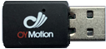
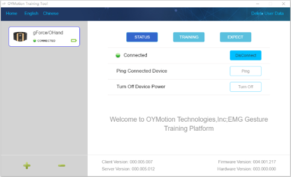
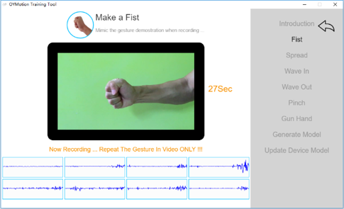
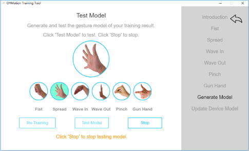

# 适用于gForcePro的OTrain

* OTrain 用于从 gForcePro 采集肌电数据、训练手势模型并将模型下载至 gForcePro
* 手势可自定义
* gForcePro 更新训练模型后可离线工作

***

## 硬件要求

* **gForcePro**

* **USB Dongle**

***

## 截图

***

## 下载

[点击此处](https://github.com/oymotion/OTrain/releases){: target="_blank"} 下载
