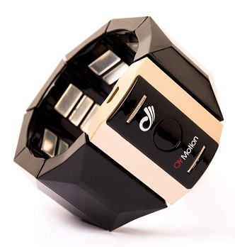
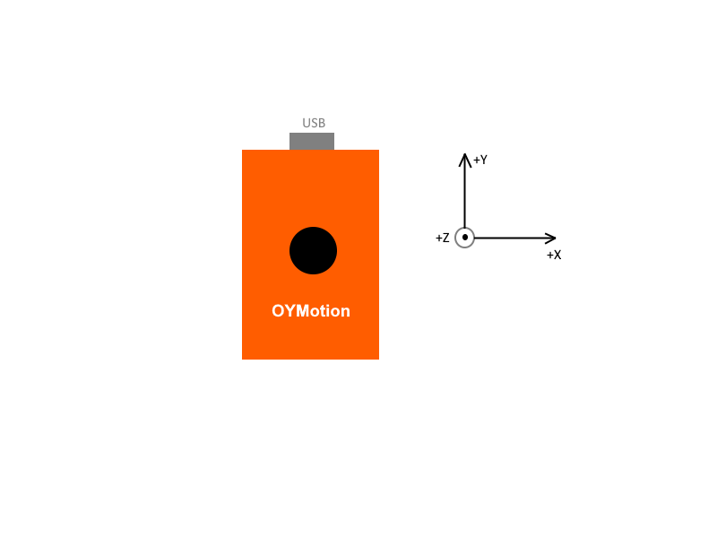

# gForce 200 臂环用户指南

***

## 概述

gForce 200臂环是一款[智能可穿戴人机交互设备][HID]{: target="_blank"} 专用于
[手势识别][GestureRecognition]{: target="_blank"}. 它通过检测人体前臂的表面肌电信号来识别手势，并利用内置的9轴[IMU][IMU]{: target="_blank"}计算出四元数或[欧拉角][EulerAngles]{: target="_blank"}形式的方位数据.

与基于计算机视觉技术的其他手势识别设备相比，gForce臂环具有不依赖环境光线、无角度限制、能耗显著降低及成本大幅减少等优势.

## 开启/关闭

- 开启

    当gForce 200臂环处于关闭状态时，其绿色LED指示灯将熄灭. 如需开启，请长按主模块中央按钮约1秒，直至绿色LED灯亮起.

    当gForce 200臂环开机时，会产生约0.2秒的振动. 成功启动后，绿色LED灯将以1/4Hz频率闪烁（即亮2秒、灭2秒）.

    请确保臂环电量充足，如电量不足请使用Micro USB线进行充电.

- 关闭

    当gForce 200臂环处于开启状态时，长按按钮约5秒后松开即可将其关闭。绿色LED指示灯熄灭表明设备已成功关闭.

**注意**:
> 如未使用gForce 200臂环，请及时关闭设备. 目前尚未实现自动低功耗模式.

## 充电

gForce 200臂环配备锂离子电池 (200mAh). 主模块上的USB端口用于电池充电.

充电期间，主模块上的红色LED指示灯常亮. 充电最多需要2小时，充电完成后红色LED指示灯将熄灭.

**注意**:
>gForce 200臂环并非设计为在充电时工作，因为这会引入电气噪声，污染微弱的肌电生物特征信号.

## 其他状态指示

- 成功连接BLE中心设备（例如gForceJoint、gForceDongle或其他BLE中心设备）后，当任何数据（如四元数、手势或原始数据）开关开启时，绿色LED灯将以5Hz频率闪烁.

- 当识别到手势时，设备将振动约200毫秒.

## 佩戴与执行手势的指导说明

为确保 gForce 臂环能够准确识别您的手势，请参阅 [手势执行指南][GuideToPerformingGestures]{: target="_blank"} ，并花费几分钟时间进行学习和自我训练。在您熟悉并正确执行这些手势后，识别率可达 95% 甚至更高。

## IMU

开机时, IMU 方向如下图所示:

但按下多功能按钮时方向将被重置. 您可以在 [gForce APP](../APPs/gForceApp.md) 中查看IMU数据.

## 预定义手势

六个预定义手势分别为:

- _握拳手势_
- _张开手指_
- _向内挥动_
- _向外挥动_
- _捏合手势_
- _射击手势_

**注意**:
> 当您的手臂和手部均处于静止状态时，该状态将被识别为'_放松_' 手势.

## 获取手势/四元数/IMU数据

针对数据获取，我们提供以下SDK:
使用 [gForceSDKCXX](https://github.com/oymotion/gForceSDKCXX){: target="_blank"}, [gForceSDKCSharp](https://github.com/oymotion/gForceSDKCSharp){: target="_blank"}, [gForceSDKPython](https://github.com/oymotion/gForceSDKPython){: target="_blank"} 开发工具包来获取手势/四元数/IMU等数据.
具体帮助请参阅 [SDK 列表](../SDK/SDKList.md) & [gForceSDK 手册](../SDK/gForceSDK.md).

***

## 用户指南

[点击此处](../../../assets/downloads/gForce/gForce-EMG-ARMBAND-User-Guide-202108.pdf){: target="_blank"} 获取gForce200用户指南PDF版本.

[HID]: https://en.wikipedia.org/wiki/Human_interface_device
[GestureRecognition]: https://en.wikipedia.org/wiki/Gesture_recognition
[EulerAngles]: https://en.wikipedia.org/wiki/Euler_angles
[IMU]: https://en.wikipedia.org/wiki/Inertial_measurement_unit
[GuideToPerformingGestures]: https://www.youtube.com/watch?v=wBsYJf0wrkk
