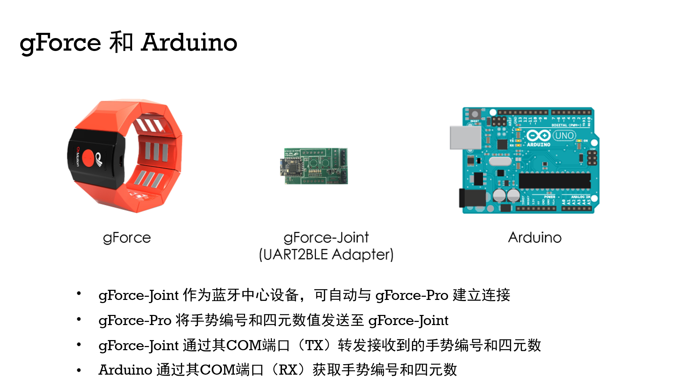
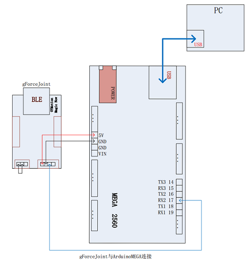

# gForce Joint

***

## 概述

本文档旨在指导如何将gForce手势臂环与Arduino结合使用.
在继续操作前，请确保您具备足够的 [Arduino](https://www.arduino.cc/){: target="_blank"} 使用经验, 并且已在电脑上安装 [ArduinoIDE](https://www.arduino.cc/en/Main/Software){: target="_blank"} .

* [Arduino是什么](https://www.arduino.cc/en/Guide/Introduction){: target="_blank"}
* [怎么安装 ArduinoIDE](https://www.arduino.cc/en/Main/Software){: target="_blank"}
* [学习 Arduino](https://www.arduino.cc/en/Reference/HomePage){: target="_blank"}

## gForce Joint 使用指南

本章节指导如何将gForce Joint连接至臂环。下文将使用以下术语：gForceJoint、gForce、gForceSDKArduino、ArduinoMEGA

* [gForce200 是什么](../gForce200/gForce200UserGuide.md)
* [gForcePro/Pro+/Oct 是什么](../gForcePro/gForcePro.md)
* [gForceSDKArduino 是什么](https://github.com/oymotion/gForceSDKArduino){: target="_blank"}
* [ArduinoMEGA 是什么](https://www.arduino.cc/en/Main/arduinoBoardMega){: target="_blank"}

### 步骤 1: 导入 gForceSDKArduino  

* [如何导入 gForceSDKArduino](https://github.com/oymotion/gForceSDKArduino){: target="_blank"}

### 步骤 2: 测试gForceJoint与ArduinoMEGA之间的通信

1. 在本演示案例中，gForceJoint连接到MEGA的串行端口 #2 (gForceJoint (TX) => MEGA (RX2))
2. 在ArduinoIDE中打开 [gForceJointTest](https://github.com/oymotion/gForceSDKArduino/blob/master/examples/gForceJointTest/gForceJointTest.ino){: target="_blank"}. 编译并上传至ArduinoMEGA.
3. 从ArduinoIDE中打开串口监视器.
4. 将串口监视器的波特率设置为115200bps.
5. 将gForce臂环与gForceJoint配对连接，执行预定义的手势，检查串口监视器中打印的信息是否正确，从而确保gForceJoint与MEGA之间的连接正常工作.

## Q&A

> 如何佩戴gForce臂环?

如果使用gForce-100/gForce-200，用户应严格遵循 [佩戴说明](https://oymotion.github.io/assets/downloads/gForce100_manual_v1.1-eng.pdf){: target="_blank"} 和手势规范.

> 如何无线连接gForce与gForceJoint?

1. 开启gForce臂环，绿色LED指示灯应会缓慢闪烁
1. 确保gForceJoint已通电启动
1. 将gForce臂环靠近gForceJoint，保持距离在10厘米以内.
1. gForce臂环将自动连接至gForceJoint，此时绿色LED指示灯闪烁频率会显著加快.
1. 若未成功连接，请确保gForceJoint未与其他gForce臂环连接（仅允许连接一个臂环），并确认设备已通电.

**注意**:
在继续操作前，务必确保gForceJoint与ArduinoMEGA能正常工作。可能存在的问题包括:

* gForceJoint与ArduinoMEGA之间的接线错误
* gForce未能与gForceJoint连接可能是由于距离过远. 在进行连接时，gForce臂环与gForceJoint必须尽可能靠近，建议保持10厘米以内的短距离.
* 用户未按照规范佩戴臂环及执行手势.
