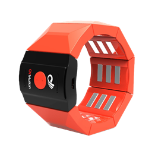
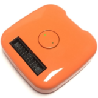

# gForcePro/gForcePro+ 臂环和 gForceOct 模块用户指南

***

## 概述

gForcePro/gForcePro+臂环或 gForceOct 模块是一款智能可穿戴 [人机交互设备][HID]{: target="_blank"} 专用于
[手势识别][GestureRecognition]{: target="_blank"}. 它根据人体前臂的表面肌电信号识别手势, 并通过内置的9轴[IMU][IMU]{: target="_blank"}计算出四元数或[欧拉角][EulerAngles]{: target="_blank"}形式的方位数据.

与基于计算机视觉技术的其他手势识别设备相比，gForce臂环具有不依赖环境光线、无角度限制、能耗显著降低以及成本大幅减少等优势.

***gForcePro+***

***gForceOct***

**注意**:
> gForcePro 已停产。新采购订单请选择 gForcePro+.

***

## 开启/关闭

- **开启**

    当gForcePro/gForcePro+或gForceOct模块臂环处于关闭状态时，其绿色LED指示灯将熄灭. 如需开启，请长按主模块中央按钮约1秒，直至绿色LED灯亮起.

    当gForcePro/gForcePro+臂环或gForceOct模块开机时，会产生约0.2秒的振动。成功启动后，绿色LED灯将以1/4Hz频率闪烁（即亮2秒、灭2秒）.

    请确保臂环电量充足，如电量不足请使用Micro USB线进行充电.

- **关闭**

    当gForcePro/gForcePro+臂环或gForceOct模块处于开启状态时，长按按钮约5秒后松开即可将其关闭. 绿色LED指示灯熄灭表明设备已成功关闭.

**注意**:
> 如未使用gForcePro/gForcePro+臂环或gForceOct模块，请及时关闭设备. 目前尚未实现自动低功耗模式.

***

## 充电

gForcePro/gForcePro+臂环或gForceOct模块配备锂离子电池（200毫安）. 主模块上的USB端口用于电池充电.

充电期间，主模块上的红色LED指示灯常亮. 充电最多需要2小时，充电完成后红色LED指示灯将熄灭.

**注意**:
>gForcePro/gForcePro+臂环或gForceOct模块并非设计为在充电时工作，因为这会引入电气噪声，污染微弱的肌电生物特征信号.

***

## 其他状态指示

- 成功连接BLE中心设备（例如gForceJoint、gForceDongle或任何其他BLE中心设备）后，当任何数据（例如四元数、手势或原始数据）开关处于开启状态时，绿色LED灯将以5Hz频率闪烁.

- 当识别到手势时，设备将振动约100毫秒.

***

## IMU

开机时，IMU方向如下所示:

但按下多功能按钮时方向将被重置. 您可以在[gForce APP](../APPs/gForceApp.md)中查看IMU数据.

***

## 手势训练

- **gForcePro**
  
    gForcePro支持通过OTrain桌面应用程序进行用户手势训练.
    更多详情请参阅 [OTrain](../APPs/OTrain.md).

- **gForcePro+/gForceOct**
  
    gForcePro+/gForceOct使用gForce应用程序进行用户手势训练.
    更多详情请参阅 [gForce APP](../APPs/gForceApp.md).

***

## 获取EMG/四元数/...数据

针对数据获取，我们提供SDK及即用型终端工具:

- **通过 SDK**
  
    使用 [gForceSDKCXX](https://github.com/oymotion/gForceSDKCXX){: target="_blank"}, [gForceSDKCSharp](https://github.com/oymotion/gForceSDKCSharp){: target="_blank"}, [gForceSDKPython](https://github.com/oymotion/gForceSDKPython){: target="_blank"} 来获取EMG数据等.
    具体帮助请参阅 [SDK list](../SDK/SDKList.md) & [gForceSDK manual](../SDK/gForceSDK.md).

- **通过 oym8CHWave**
  
    更多详情请参阅 [oym8CHWave](../APPs/oym8CHWave.md).

***

## 用户指南

[点击此处](../../../assets/downloads/gForce/gForce-EMG-ARMBAND-User-Guide-202108.pdf){: target="_blank"} 获取gForcePro+/gForceOct用户指南PDF版本.

[HID]: https://en.wikipedia.org/wiki/Human_interface_device
[GestureRecognition]: https://en.wikipedia.org/wiki/Gesture_recognition
[EulerAngles]: https://en.wikipedia.org/wiki/Euler_angles
[IMU]: https://en.wikipedia.org/wiki/Inertial_measurement_unit
